# Explore Two Variables
Justin Le  
October 26, 2017  


```r
library(ggplot2)
library(gridExtra)
library(dplyr)
```

```
## Warning: package 'dplyr' was built under R version 3.4.2
```

```
## 
## Attaching package: 'dplyr'
```

```
## The following object is masked from 'package:gridExtra':
## 
##     combine
```

```
## The following objects are masked from 'package:stats':
## 
##     filter, lag
```

```
## The following objects are masked from 'package:base':
## 
##     intersect, setdiff, setequal, union
```

```r
setwd('D:/Udacity Data Analysis with R/Lesson 4')
pf <- read.csv('pseudo_facebook.tsv', sep = '\t')
```

***

### Scatterplots
Notes: Use for two continuous variables, qplot automatically does it when passed with two...


```r
qplot(x = age, y = friend_count, data = pf)
```

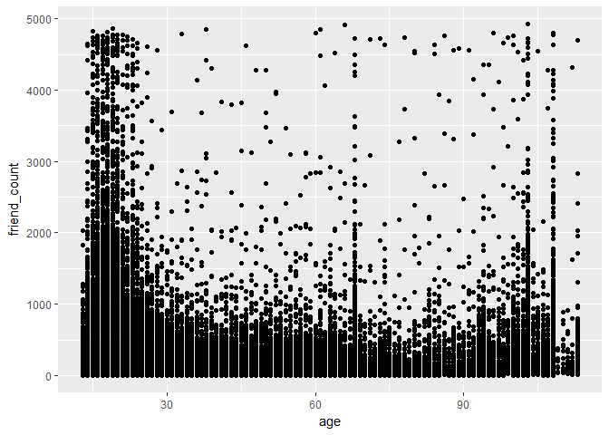<!-- -->

```r
qplot(age, friend_count, data = pf)
```

<!-- -->

***

#### What are some things that you notice right away?
Response: Looks like younger users have a lot of friends. Also vertical bars at 69, 100, etc. Maybe
due to teenagers lying about their age.

***

### ggplot Syntax
Notes:aes - aesthetic wrapper, and specify geom


```r
ggplot(aes(x = age, y = friend_count), data = pf) +
  geom_point() +
  xlim(13, 90)
```

```
## Warning: Removed 4906 rows containing missing values (geom_point).
```

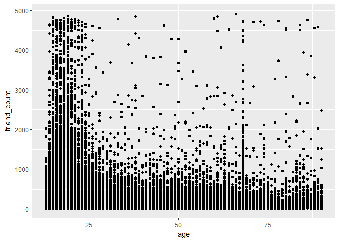<!-- -->

```r
summary(pf$age)
```

```
##    Min. 1st Qu.  Median    Mean 3rd Qu.    Max. 
##   13.00   20.00   28.00   37.28   50.00  113.00
```

***

### Overplotting
Notes: Some points are stacked on top over each other. It makes it difficult to tell how many
points are in each region. Setting transparency with alpha


```r
ggplot(aes(x = age, y = friend_count), data = pf) +
  geom_point(alpha = 1/20) +
  xlim(13, 90)
```

```
## Warning: Removed 4906 rows containing missing values (geom_point).
```

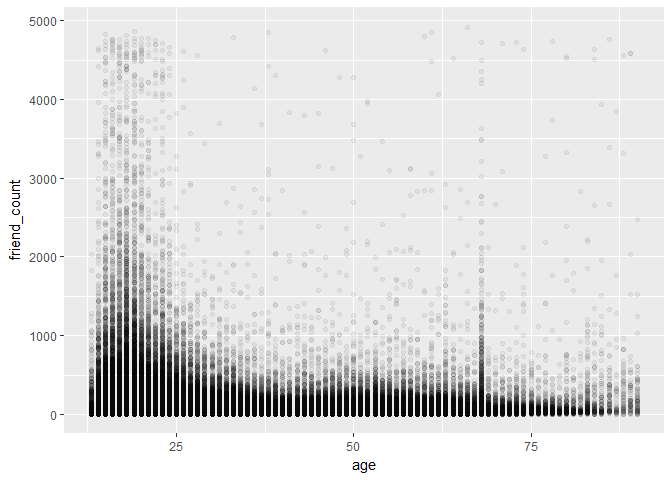<!-- -->


```r
ggplot(aes(x = age, y = friend_count), data = pf) +
  geom_jitter(alpha = 1/20) +
  xlim(13, 90)
```

```
## Warning: Removed 5189 rows containing missing values (geom_point).
```

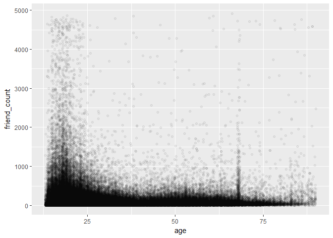<!-- -->

#### What do you notice in the plot?
Response: The alpha took 20 points to be the equivalent to 1 of the black dots. The bulk
of the data lies below the 1000 threshold. With geom_point, we see integer values with perfect
lined columns (Not a true reflection of age). With geom_jitter, we can see more of the points
and a more dispersed distribution. 

With the jitter plot we see the the friend count of young users aren't nearly as high. The bulk
really have friend counts below 1000. Alpha is 1/20, so it takes 20 points for a dot to be
completely dark. 

***

### Coord_trans()
Notes: To better visualize the data.


```r
ggplot(aes(x = age, y = friend_count), data = pf) +
  geom_point(alpha = 1/20) +
  xlim(13, 90) +
  coord_trans(y = 'sqrt')
```

```
## Warning: Removed 4906 rows containing missing values (geom_point).
```

-1.png)<!-- -->

Look up the documentation for coord_trans() and add a layer to the plot that transforms friend_count using the square root function.


```r
ggplot(aes(x = age, y = friend_count), data = pf) +
  geom_point(alpha = 1/20, position = position_jitter(h = 0)) +
  xlim(13, 90) +
  coord_trans(y = 'sqrt')
```

```
## Warning: Removed 5193 rows containing missing values (geom_point).
```

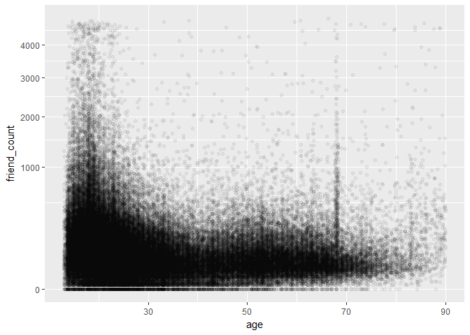<!-- -->

#### What do you notice?
Went back to geom_point because we need to use more syntax if we want jitter. Use syntax to jitter only the ages. Also, need
to be careful because some people have friend counts of 0. If we add noise we might end up with negative numbers. More syntax,
but prevents from having warning message and getting negative friend counts. Jitter can add positive or negative noise.
***

### Alpha and Jitter
Notes: Explore the relationship between friends initiated and age.


```r
ggplot(aes(x = age, y = friendships_initiated), data = pf) +
  geom_point(alpha = 1/25, position = position_jitter(h = 0)) +
  coord_trans(y = 'sqrt')
```

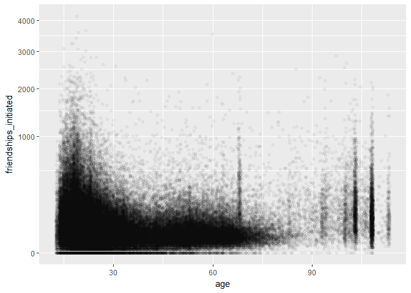<!-- -->

***

### Overplotting and Domain Knowledge
Notes: Sometimes you want to know how the mean or median varies to another variable. Example, how does the average
friend count vary over age?

***

### Conditional Means
Notes: n = n() is the number of users in each group


```r
age_groups <- group_by(pf, age)
pf.fc_by_age <- summarise(age_groups,
          friend_count_mean = mean(friend_count),
          friend_count_median = median(friend_count),
          n = n())
pf.fc_by_age <- arrange(pf.fc_by_age, age)

#use above to asc ages, but it is already arranged
#n() function can only be used with summarise

head(pf.fc_by_age)
```

```
## # A tibble: 6 x 4
##     age friend_count_mean friend_count_median     n
##   <int>             <dbl>               <dbl> <int>
## 1    13          164.7500                74.0   484
## 2    14          251.3901               132.0  1925
## 3    15          347.6921               161.0  2618
## 4    16          351.9371               171.5  3086
## 5    17          350.3006               156.0  3283
## 6    18          331.1663               162.0  5196
```

### Conditional Means Alternate Code
Notes: By using %>%, we can chain functions onto data set


```r
pf.fc_by_age <- pf %>%
  group_by(age) %>%
  summarise(friend_count_mean = mean(friend_count),
            friend_count_median = median(friend_count),
            n = n()) %>%
  arrange(age)

head(pf.fc_by_age)
```

```
## # A tibble: 6 x 4
##     age friend_count_mean friend_count_median     n
##   <int>             <dbl>               <dbl> <int>
## 1    13          164.7500                74.0   484
## 2    14          251.3901               132.0  1925
## 3    15          347.6921               161.0  2618
## 4    16          351.9371               171.5  3086
## 5    17          350.3006               156.0  3283
## 6    18          331.1663               162.0  5196
```

Plot mean friend count vs. age using a line graph. Be sure you use the correct variable names
and the correct data frame. You should be working with the new data frame created from the dplyr
functions. The data frame is called 'pf.fc_by_age'.

Use geom_line() rather than geom_point to create the plot.


```r
ggplot(aes(x = age, y = friend_count_mean), data = pf.fc_by_age) +
  geom_line()
```

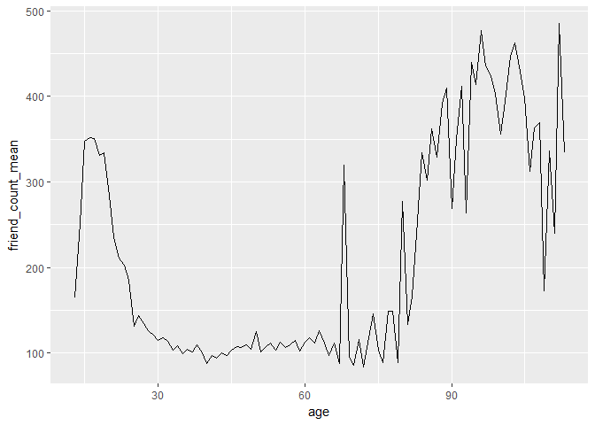<!-- -->

***

### Overlaying Summaries with Raw Data
Notes: Used quantiles because we can't immediately see how dispersed the data is around the mean with just the mean line.
We added the 10%, 50%, and 90% quantiles to the graph. Example, 90%: 90% of users have friend counts below this line.


```r
ggplot(aes(x = age, y = friend_count), data = pf) +
  geom_point(alpha = 1/20,
             position = position_jitter(h = 0),
             color = 'orange') +
  xlim(13, 90) +
  coord_trans(y = 'sqrt') +
  geom_line(stat = 'summary', fun.y = mean) +
  geom_line(stat = 'summary', fun.y = quantile, fun.args = list(probs = 0.1),
            linetype = 2, color = 'blue') +
  geom_line(stat = 'summary', fun.y = quantile, fun.args = list(probs = 0.5),
            color = 'blue') +
  geom_line(stat = 'summary', fun.y = quantile, fun.args = list(probs = 0.9),
            linetype = 2, color = 'blue')
```

```
## Warning: Removed 4906 rows containing non-finite values (stat_summary).

## Warning: Removed 4906 rows containing non-finite values (stat_summary).

## Warning: Removed 4906 rows containing non-finite values (stat_summary).

## Warning: Removed 4906 rows containing non-finite values (stat_summary).
```

```
## Warning: Removed 5179 rows containing missing values (geom_point).
```

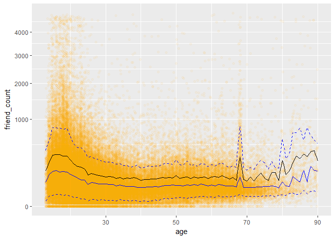<!-- -->

Notes: With the plot above, I noticed that having more than 1000 friends is quite rare. Even
for young users, that is where it peaks.

Notes: When using coord_cartesian we need to delete xlim layer and coord_trans layer first.


```r
ggplot(aes(x = age, y = friend_count), data = pf) +
  geom_point(alpha = 1/20,
             position = position_jitter(h = 0),
             color = 'orange') +
  coord_cartesian(xlim = c(13, 70), ylim = c(0, 1000)) +
  geom_line(stat = 'summary', fun.y = mean) +
  geom_line(stat = 'summary', fun.y = quantile, fun.args = list(probs = 0.1),
            linetype = 2, color = 'blue') +
  geom_line(stat = 'summary', fun.y = quantile, fun.args = list(probs = 0.5),
            color = 'blue') +
  geom_line(stat = 'summary', fun.y = quantile, fun.args = list(probs = 0.9),
            linetype = 2, color = 'blue')
```

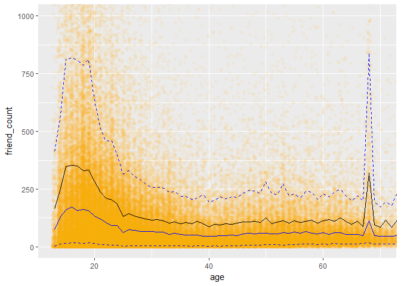<!-- -->

#### What are some of your observations of the plot?
Response: For ages between 35 and 60, the friend count falls below 250. So 90% of people
in this age group have less than 250 friends.

***

### Correlation
Notes: The correlation coefficient of two variables in a data set is equal to their covariance divided by
the product of their individual standard deviations. It is a normalized measurement of how the two are
linearly related.


```r
cor.test(pf$age, pf$friend_count, method = 'pearson')
```

```
## 
## 	Pearson's product-moment correlation
## 
## data:  pf$age and pf$friend_count
## t = -8.6268, df = 99001, p-value < 2.2e-16
## alternative hypothesis: true correlation is not equal to 0
## 95 percent confidence interval:
##  -0.03363072 -0.02118189
## sample estimates:
##         cor 
## -0.02740737
```

```r
with(pf, cor.test(age, friend_count, method = 'pearson'))
```

```
## 
## 	Pearson's product-moment correlation
## 
## data:  age and friend_count
## t = -8.6268, df = 99001, p-value < 2.2e-16
## alternative hypothesis: true correlation is not equal to 0
## 95 percent confidence interval:
##  -0.03363072 -0.02118189
## sample estimates:
##         cor 
## -0.02740737
```

Look up the documentation for the cor.test function.

What's the correlation between age and friend count? Round to three decimal places.
Response: -0.0274: This indicates that there is no meaningful relationship between the two variables.
The relationship is not linear.

A correlation of greater than 0.3 or less than -0.3 is meaningful, but small. +/- 0.5 is moderate, and 
0.7 is pretty large.

Also the with() function let's us evaluate an R expression in an environment constructed from the data.

***

### Correlation on Subsets
Notes: Maybe we don't want the older ages in our correlation number, since older ages are likely to be incorrect.
In the summary, cor coef is -0.171 which means as age increases friend count decreases.


```r
with(subset(pf, age <= 70), cor.test(age, friend_count))
```

```
## 
## 	Pearson's product-moment correlation
## 
## data:  age and friend_count
## t = -52.592, df = 91029, p-value < 2.2e-16
## alternative hypothesis: true correlation is not equal to 0
## 95 percent confidence interval:
##  -0.1780220 -0.1654129
## sample estimates:
##        cor 
## -0.1717245
```

***

### Correlation Methods
Notes: Other types of relationships. Different uses and assumptions. Can read up on it.


```r
with(subset(pf, age <= 70), cor.test(age, friend_count, method = 'spearman'))
```

```
## Warning in cor.test.default(age, friend_count, method = "spearman"): Cannot
## compute exact p-value with ties
```

```
## 
## 	Spearman's rank correlation rho
## 
## data:  age and friend_count
## S = 1.5782e+14, p-value < 2.2e-16
## alternative hypothesis: true rho is not equal to 0
## sample estimates:
##        rho 
## -0.2552934
```

***

## Create Scatterplots
Notes: Looking at variables that are highly correlated.

Create a scatterplot of likes_received (y) vs. www_likes_received (x). Use any of the
techniques that you've learned so far to modify the plot.


```r
ggplot(aes(x = www_likes_received, y = likes_received), data = pf) +
  geom_point()
```

<!-- -->

***

### Strong Correlations
Notes: use quantile to get a percentage of the data you want to look at, quantile(axis_name, percentage)
Also, to put a line of best fit use geom_smooth with a linear method, 'lm'.


```r
ggplot(aes(x = www_likes_received, y = likes_received), data = pf) +
  geom_point() +
  xlim(0, quantile(pf$www_likes_received, 0.95)) +
  ylim(0, quantile(pf$likes_received, 0.95)) +
  geom_smooth(method = 'lm', color = 'red')
```

```
## Warning: Removed 6075 rows containing non-finite values (stat_smooth).
```

```
## Warning: Removed 6075 rows containing missing values (geom_point).
```

<!-- -->

What's the correlation betwen the two variables? Include the top 5% of values for the variable in the calculation and round to 3 decimal places.


```r
with(pf, cor.test(www_likes_received, likes_received, method = 'pearson'))
```

```
## 
## 	Pearson's product-moment correlation
## 
## data:  www_likes_received and likes_received
## t = 937.1, df = 99001, p-value < 2.2e-16
## alternative hypothesis: true correlation is not equal to 0
## 95 percent confidence interval:
##  0.9473553 0.9486176
## sample estimates:
##       cor 
## 0.9479902
```

Response: 0.948, a really strong positive correlation

***

### Moira on Correlation
Notes: One of the assumptions of these regressions is that they're independent of each other. If any two are
highly correlated with each other it makes it really difficult to tell which one is driving the phenomenon.
Would want to do these correlation test first to determine which ones you don't want to put in and maybe help
decide which ones you want to keep.

***

### More Caution with Correlation
Notes:


```r
library(alr3)
```

```
## Loading required package: car
```

```
## Warning: package 'car' was built under R version 3.4.2
```

```
## 
## Attaching package: 'car'
```

```
## The following object is masked from 'package:dplyr':
## 
##     recode
```

```r
data("Mitchell")
head(Mitchell)
```

```
##   Month     Temp
## 1     0 -5.18333
## 2     1 -1.65000
## 3     2  2.49444
## 4     3 10.40000
## 5     4 14.99440
## 6     5 21.71670
```


```r
ggplot(aes(x = Month, y = Temp), data = Mitchell) +
  geom_point()
```

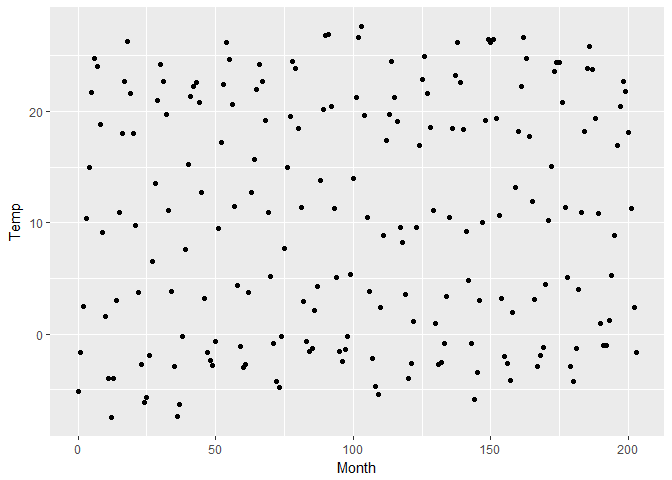<!-- -->

***

### Noisy Scatterplots
a. Take a guess for the correlation coefficient for the scatterplot.
Well, the axis aren't scaled to a 1:1 ratio. Does that make a difference? Otherwise, pretty close to 0.

b. What is the actual correlation of the two variables?
(Round to the thousandths place) 0.057, pretty weak correlation


```r
with(Mitchell, cor.test(Month, Temp, method = 'pearson'))
```

```
## 
## 	Pearson's product-moment correlation
## 
## data:  Month and Temp
## t = 0.81816, df = 202, p-value = 0.4142
## alternative hypothesis: true correlation is not equal to 0
## 95 percent confidence interval:
##  -0.08053637  0.19331562
## sample estimates:
##        cor 
## 0.05747063
```

***

### Making Sense of Data
Notes: You know that Months is very discrete, from Jan to Dec repeating.
Can do summary(Mitchell$Months),
or use range(Mitchell$Months) to see the max.


```r
ggplot(aes(x = Month, y = Temp), data = Mitchell) +
  geom_point() +
  scale_x_continuous(breaks = seq(0, 203, 12))
```

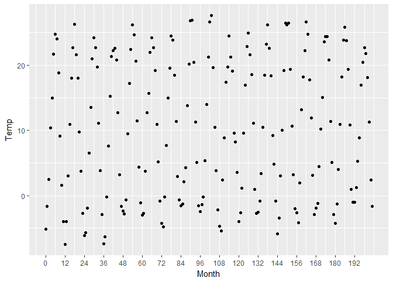<!-- -->

***

### A New Perspective

What do you notice?
Notes: Cyclical pattern. Like a sin graph. Always put your data in context. Proportion
and scale of your graphic do matter. The nature of the data should suggest the shape of
the graphic. Otherwise, have a graphic 50% wider than it is tall.

You could also get perspective on this data by overlaying each year's data on top of each other,
giving a clear, generally sinusoidal graph by using the R's modulus operator %%.


```r
ggplot(aes(x = (Month%%12), y = Temp), data = Mitchell) +
  geom_point()
```

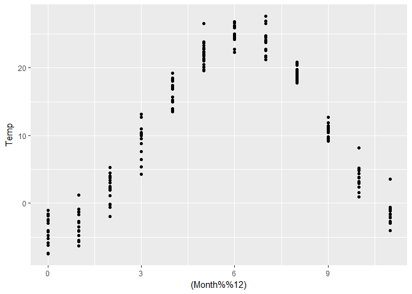<!-- -->

***

### Understanding Noise: Age to Age Months
Notes: The black line has a lot of random noise to it. The mean friend count
rises and falls after each age.


```r
ggplot(aes(x = age, y = friend_count_mean), data = pf.fc_by_age) +
  geom_line()
```

<!-- -->

```r
head(pf.fc_by_age, 10)
```

```
## # A tibble: 10 x 4
##      age friend_count_mean friend_count_median     n
##    <int>             <dbl>               <dbl> <int>
##  1    13          164.7500                74.0   484
##  2    14          251.3901               132.0  1925
##  3    15          347.6921               161.0  2618
##  4    16          351.9371               171.5  3086
##  5    17          350.3006               156.0  3283
##  6    18          331.1663               162.0  5196
##  7    19          333.6921               157.0  4391
##  8    20          283.4991               135.0  3769
##  9    21          235.9412               121.0  3671
## 10    22          211.3948               106.0  3032
```

```r
pf.fc_by_age[17:19, ]
```

```
## # A tibble: 3 x 4
##     age friend_count_mean friend_count_median     n
##   <int>             <dbl>               <dbl> <int>
## 1    29          120.8182                66.0  1936
## 2    30          115.2080                67.5  1716
## 3    31          118.4599                63.0  1694
```

***

### Age with Months Means
Notes: We're gonna put ages in months instead of years, would make finer bins and more noise

Create a new variable, 'age_with_months', in the 'pf' data frame.
Be sure to save the variable in the data frame rather than creating
a separate, stand-alone variable. You will need to use the variables
'age' and 'dob_month' to create the variable 'age_with_months'.


```r
pf$age_with_months <- with(pf, age + (1 - dob_month / 12))

#or  pf$age_with_months <- pf$age + (1 - pf$dob_month / 12)
```

Create a new data frame called pf.fc_by_age_months that contains the mean friend count,
the median friend count, and the number of users in each group of age_with_months. The rows
of the data framed should be arranged in increasing order by the age_with_months variable.

Programming Assignment

```r
pf.fc_by_age_months <- pf %>%
  group_by(age_with_months) %>%
  summarise(friend_count_mean = mean(friend_count),
            friend_count_median = median(friend_count),
            n = n()) %>%
  arrange(age_with_months)

head(pf.fc_by_age_months)
```

```
## # A tibble: 6 x 4
##   age_with_months friend_count_mean friend_count_median     n
##             <dbl>             <dbl>               <dbl> <int>
## 1        13.16667          46.33333                30.5     6
## 2        13.25000         115.07143                23.5    14
## 3        13.33333         136.20000                44.0    25
## 4        13.41667         164.24242                72.0    33
## 5        13.50000         131.17778                66.0    45
## 6        13.58333         156.81481                64.0    54
```

```r
# age_with_months_groups <- group_by(pf, age_with_months)
# pf.fc_by_age_months <- summarise(age_with_months_groups,
                                 # friend_count_mean = mean(friend_count),
                                 # friend_count_median = median(friend_count),
                                 # n = n())
# pf.fc_by_age_months <- arrange(pf.fc_by_age_months, age_with_months)
```

***

### Noise in Conditional Means
Create a new line plot showing friend_count_mean versus the new variable,
age_with_months. Be sure to use the correct data frame (the one you created
in the last exercise) AND subset the data to investigate users with ages less
than 71.


```r
ggplot(aes(x = age_with_months, y = friend_count_mean),
       data = subset(pf.fc_by_age_months, age_with_months < 71)) +
  geom_line()
```

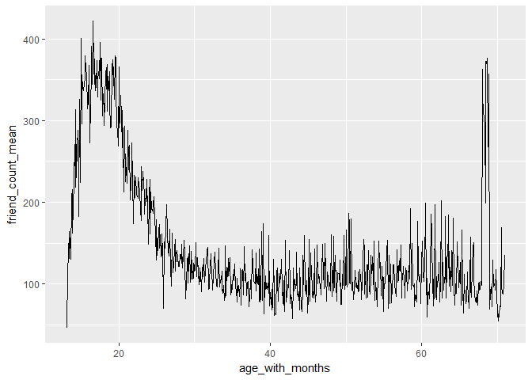<!-- -->

***

### Smoothing Conditional Means
Notes:


```r
p1 <- ggplot(aes(x = age, y = friend_count_mean),
       data = subset(pf.fc_by_age, age < 71)) +
  geom_line() +
  geom_smooth()

p2 <- ggplot(aes(x = age_with_months, y = friend_count_mean),
       data = subset(pf.fc_by_age_months, age_with_months < 71)) +
  geom_line() +
  geom_smooth()

p3 <- ggplot(aes(x = round(age/5) * 5, y = friend_count),
       data = subset(pf, age < 71)) +
  geom_line(stat = 'summary', fun.y = mean)

grid.arrange(p2, p1, p3, ncol = 1)
```

```
## `geom_smooth()` using method = 'loess'
## `geom_smooth()` using method = 'loess'
```

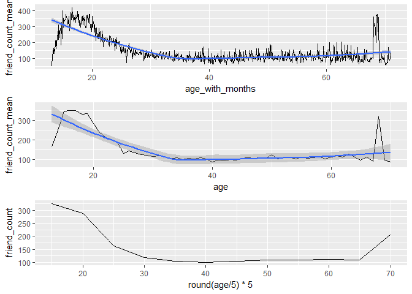<!-- -->

***

### Which Plot to Choose?
Notes: Each plot tells something about the data. But when sharing to an audience, choose
those that show your main findings.

***

### Analyzing Two Variables
Reflection: Scatterplots and augmented them using conditional means, also benifits and limits
using correlation to understand the relationship between two variables, and how correlation 
can affect which variables to include in your final models. Learned not to trust inital plots
such as with the seasonal temperature, and also used jitter and transparency to reduce overlay.

***
