# Explore Many Variables
Justin Le  
October 26, 2017  


```r
library(ggplot2)
library(gridExtra)
library(dplyr)
```

```
## Warning: package 'dplyr' was built under R version 3.4.2
```

```
## 
## Attaching package: 'dplyr'
```

```
## The following object is masked from 'package:gridExtra':
## 
##     combine
```

```
## The following objects are masked from 'package:stats':
## 
##     filter, lag
```

```
## The following objects are masked from 'package:base':
## 
##     intersect, setdiff, setequal, union
```

```r
pf <- read.csv('pseudo_facebook.tsv', sep = '\t')
names(pf)
```

```
##  [1] "userid"                "age"                  
##  [3] "dob_day"               "dob_year"             
##  [5] "dob_month"             "gender"               
##  [7] "tenure"                "friend_count"         
##  [9] "friendships_initiated" "likes"                
## [11] "likes_received"        "mobile_likes"         
## [13] "mobile_likes_received" "www_likes"            
## [15] "www_likes_received"
```

***

### Moira Perceived Audience Size Colored by Age
Notes: Didn't really see, or it was hard to see

***

### Third Qualitative Variable
Notes:


```r
ggplot(aes(x = gender, y = age),
       data = subset(pf, !is.na(gender))) + 
  geom_boxplot() +
  stat_summary(fun.y = mean, geom = 'point', shape = 4)
```

<!-- -->


```r
ggplot(aes(x = age, y = friend_count),
       data = subset(pf, !is.na(gender))) + 
  geom_line(aes(color = gender),
            stat = 'summary', fun.y = median)
```

<!-- -->

Notes: We can see that nearly everywhere, the median friend count for women is higher than men. Exception
for the older ages, discrepensies because of the 69, 100 age thing. 

***

Write code to create a new data frame, called 'pf.fc_by_age_gender', that contains
information on each age AND gender group.

The data frame should contain the following variables:

   mean_friend_count,
   median_friend_count,
   n (the number of users in each age and gender grouping)


```r
pf.fc_by_age_gender <- pf %>%
  filter(!is.na(gender)) %>%
  group_by(age, gender) %>%
  summarise(mean_friend_count = mean(friend_count),
            median_friend_count = median(friend_count),
            n = n()) %>%
  ungroup() %>%
  arrange(age)

head(pf.fc_by_age_gender)
```

```
## # A tibble: 6 x 5
##     age gender mean_friend_count median_friend_count     n
##   <int> <fctr>             <dbl>               <dbl> <int>
## 1    13 female          259.1606               148.0   193
## 2    13   male          102.1340                55.0   291
## 3    14 female          362.4286               224.0   847
## 4    14   male          164.1456                92.5  1078
## 5    15 female          538.6813               276.0  1139
## 6    15   male          200.6658               106.5  1478
```

Notes: Summarise will remove one layer of grouping when it runs. Removing the gender layer. Need to ungroup one
more time to remove the age layer. Used filter to remove any people who have their gender marked as na.

***

### Plotting Conditional Summaries
Notes:

Create a line graph showing the median friend count over the ages
for each gender. Be sure to use the data frame you just created,
pf.fc_by_age_gender.


```r
ggplot(aes(x = age, y = median_friend_count),
       data = pf.fc_by_age_gender) +
  geom_line(aes(color = gender))
```

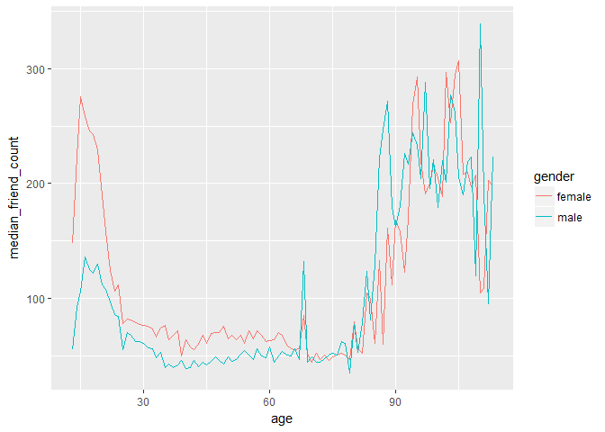<!-- -->

***

### Thinking in Ratios
Notes: How many times more friends does the average female user have than the male user?
To answer the question we need to reshape the data.

***

### Wide and Long Format
Notes: We'll have age, then male, female columns instead of the long format of many rows
of repeating of age

***

### Reshaping Data
Notes:


```r
library(tidyr)

spread(subset(pf.fc_by_age_gender, 
       select = c('gender', 'age', 'median_friend_count')), 
       gender, median_friend_count)
```

```
## # A tibble: 101 x 3
##      age female  male
##  * <int>  <dbl> <dbl>
##  1    13  148.0  55.0
##  2    14  224.0  92.5
##  3    15  276.0 106.5
##  4    16  258.5 136.0
##  5    17  245.5 125.0
##  6    18  243.0 122.0
##  7    19  229.0 130.0
##  8    20  190.0 112.0
##  9    21  158.0 108.0
## 10    22  124.0  97.0
## # ... with 91 more rows
```


```r
pf.fc_by_age_gender.wide <-
  subset(pf.fc_by_age_gender[c('age', 'gender', 'median_friend_count')],
         !is.na(gender)) %>%
  spread(gender, median_friend_count) %>%
  mutate(ratio = female/male)

head(pf.fc_by_age_gender.wide)
```

```
## # A tibble: 6 x 4
##     age female  male    ratio
##   <int>  <dbl> <dbl>    <dbl>
## 1    13  148.0  55.0 2.690909
## 2    14  224.0  92.5 2.421622
## 3    15  276.0 106.5 2.591549
## 4    16  258.5 136.0 1.900735
## 5    17  245.5 125.0 1.964000
## 6    18  243.0 122.0 1.991803
```

***

### Ratio Plot

Plot the ratio of the female to male median friend counts using the data frame
pf.fc_by_age_gender.wide.

Think about what geom you should use.Add a horizontal line to the plot with
a y intercept of 1, which will be the base line. Look up the documentation
for geom_hline to do that. Use the parameter linetype in geom_hline to make the
line dashed.

The linetype parameter can take the values 0-6:
0 = blank, 1 = solid, 2 = dashed
3 = dotted, 4 = dotdash, 5 = longdash
6 = twodash


```r
ggplot(aes(x = age, y = female/male),
       data = pf.fc_by_age_gender.wide) +
  geom_line() +
  geom_hline(yintercept = 1, alpha = 0.3, linetype = 2)
```

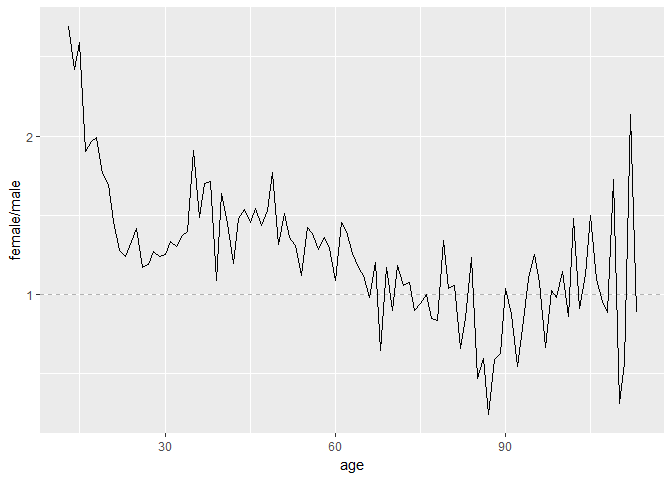<!-- -->

Notes: For very young users the median female user has over 2.5 times as many friends as the median
male user. 

***

### Third Quantitative Variable
Notes: Users are likely to accumulate friends over their time using facebook. So, facebook tenure is important
for predicting friend count. Tenure is how many days since registering with facebook and is associated with age.
One way to explore all four variables: friend count, age, gender, and tenure

Create a variable called year_joined in the pf data frame using the variable
tenure and 2014 as the reference year.

The variable year_joined should contain the year that a user joined facebook.


```r
pf$year_joined <- floor(2014 - pf$tenure/365)

head(pf)
```

```
##    userid age dob_day dob_year dob_month gender tenure friend_count
## 1 2094382  14      19     1999        11   male    266            0
## 2 1192601  14       2     1999        11 female      6            0
## 3 2083884  14      16     1999        11   male     13            0
## 4 1203168  14      25     1999        12 female     93            0
## 5 1733186  14       4     1999        12   male     82            0
## 6 1524765  14       1     1999        12   male     15            0
##   friendships_initiated likes likes_received mobile_likes
## 1                     0     0              0            0
## 2                     0     0              0            0
## 3                     0     0              0            0
## 4                     0     0              0            0
## 5                     0     0              0            0
## 6                     0     0              0            0
##   mobile_likes_received www_likes www_likes_received year_joined
## 1                     0         0                  0        2013
## 2                     0         0                  0        2013
## 3                     0         0                  0        2013
## 4                     0         0                  0        2013
## 5                     0         0                  0        2013
## 6                     0         0                  0        2013
```

***

### Cut a Variable


```r
summary(pf$year_joined)
```

```
##    Min. 1st Qu.  Median    Mean 3rd Qu.    Max.    NA's 
##    2005    2012    2012    2012    2013    2014       2
```

Notes: Most of the users joined in 2012 or 2013.


```r
table(pf$year_joined)
```

```
## 
##  2005  2006  2007  2008  2009  2010  2011  2012  2013  2014 
##     9    15   581  1507  4557  5448  9860 33366 43588    70
```

Notes: Can see the distribution of users in each year joined. Not much data in early joiners. 
To increase the data we have in each tenure category we can group some of the years together.
The cut function is often quite useful for making discreet variables from continuous or
numerical ones.

Link: https://www.r-bloggers.com/r-function-of-the-day-cut-2/

Create a new variable in the data frame called year_joined.bucket by using
the cut function on the variable year_joined.

You need to create the following buckets for the new variable, year_joined.bucket
      
       (2004, 2009]
       (2009, 2011]
       (2011, 2012]
       (2012, 2014]

Note that a parenthesis means exclude the year and a bracket means include the year.


```r
pf$year_joined.bucket <- cut(pf$year_joined,
                             c(2004, 2009, 2011, 2012, 2014))
```

Reflection: We created a variable called year_joined based on the tenure variable and
converted year_joined into the variable year_joined.bucket, a categorical variable that
binned our users into different groups. 

***

### Plotting it All Together
Notes: Table year_joined.bucket to see the distribution in each group.


```r
table(pf$year_joined.bucket, useNA = 'ifany')
```

```
## 
## (2004,2009] (2009,2011] (2011,2012] (2012,2014]        <NA> 
##        6669       15308       33366       43658           2
```

Create a line graph of friend_count vs. age so that each year_joined.bucket is a line
tracking the median user friend_count across age. This means you should have four different
lines on your plot.

You should subset the data to exclude the users whose year_joined.bucket is NA.


```r
ggplot(aes(x = age, y = friend_count),
       data = subset(pf, !is.na(year_joined.bucket))) +
  geom_line(aes(color = year_joined.bucket),
            stat = 'summary', fun.y = median)
```

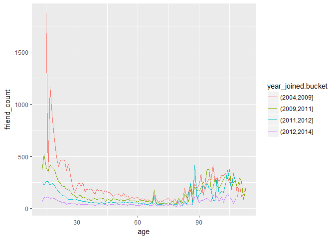<!-- -->

Notes: Here is the plot that examines the relationship between friend count and age split up
by the year_joined.bucket variable.

Users with longer tenure tend to have higher friend counts with the exception with our
older users, 80 and up. 

***

### Plot the Grand Mean

Write code to do the following:

(1) Add another geom_line to code to plot the grand mean of the friend count vs age.
(2) Exclude any users whose year_joined.bucket is NA.
(3) Use a different line type for the grand mean.


```r
ggplot(aes(x = age, y = friend_count),
       data = subset(pf, !is.na(year_joined.bucket))) +
  geom_line(aes(color = year_joined.bucket),
            stat = 'summary', fun.y = mean) +
  geom_line(stat = 'summary', fun.y = mean, linetype = 2)
```

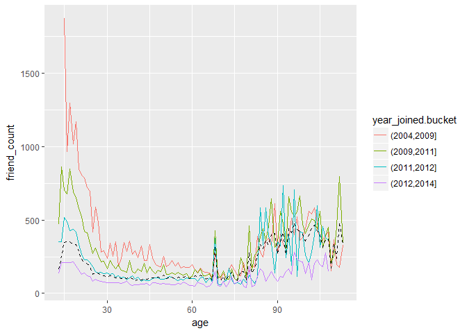<!-- -->

Notes: Plotting the grand mean is a good reminder that much of the data in the sample is about
members of the recent cohorts.

***

### Friending Rate
Notes: Since the general pattern continues to hold after conditioning on the buckets of year_joined
we might increase our confidence isn't just an artifact of the time users have had to accumulate
friends. Looking at this relationship in another way. We can look at tenure and friend count as a rate.
We can see how many friends does a user have for each day since they started using Facebook.


```r
with(subset(pf, tenure >= 1), summary(friend_count/tenure))
```

```
##     Min.  1st Qu.   Median     Mean  3rd Qu.     Max. 
##   0.0000   0.0775   0.2205   0.6096   0.5658 417.0000
```

Notes: The median friend rate is 0.22 and the max friend rate is 417 (definitely outlier).

***

### Friendships Initiated
Notes:

Create a line graph of mean of friendships_initiated per day (of tenure) vs. tenure colored by year_joined.bucket.
You need to make use of the variables tenure, friendships_initiated, and year_joined.bucket. You also need to subset 
the data to only consider user with at least one day of tenure.


```r
ggplot(aes(x = tenure, y = friendships_initiated/tenure),
       data = subset(pf, tenure >= 1)) +
  geom_line(aes(color = year_joined.bucket),
            stat = 'summary', fun.y = mean)
```

<!-- -->

Notes: It appears that users with more tenure typically initiate less friendships.

***

Instead of geom_line(), use geom_smooth() to add a smoother to the plot. You can use the defaults 
for geom_smooth() but do color the line by year_joined.bucket


```r
ggplot(aes(x = tenure, y = friendships_initiated/tenure),
       data = subset(pf, tenure >= 1)) +
  geom_smooth(aes(color = year_joined.bucket))
```

```
## `geom_smooth()` using method = 'gam'
```

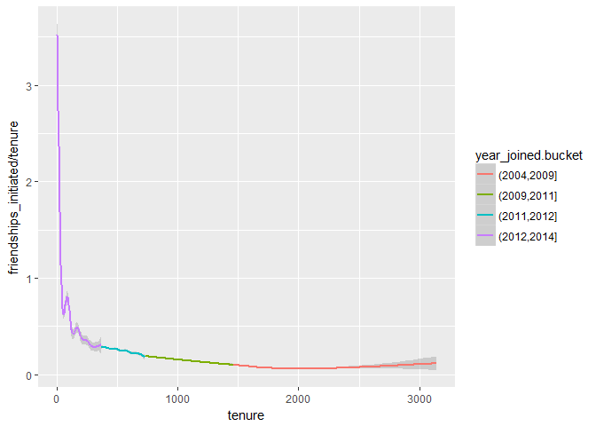<!-- -->

### Bias-Variance Tradeoff Revisited
Notes: Can adjust noise by binning x axis differently.

The code changing the binning is substituting x = tenure in the plotting expressions with 
x = 7 * round(tenure / 7), etc., binning values by the denominator in the round function and 
then transforming back to the natural scale with the constant in front.

Link: Bias-Variance Tradeoff http://scott.fortmann-roe.com/docs/BiasVariance.html


```r
ggplot(aes(x = tenure, y = friendships_initiated / tenure),
       data = subset(pf, tenure >= 1)) +
  geom_line(aes(color = year_joined.bucket),
            stat = 'summary',
            fun.y = mean)
```

<!-- -->

```r
ggplot(aes(x = 7 * round(tenure / 7), y = friendships_initiated / tenure),
       data = subset(pf, tenure > 0)) +
  geom_line(aes(color = year_joined.bucket),
            stat = "summary",
            fun.y = mean)
```

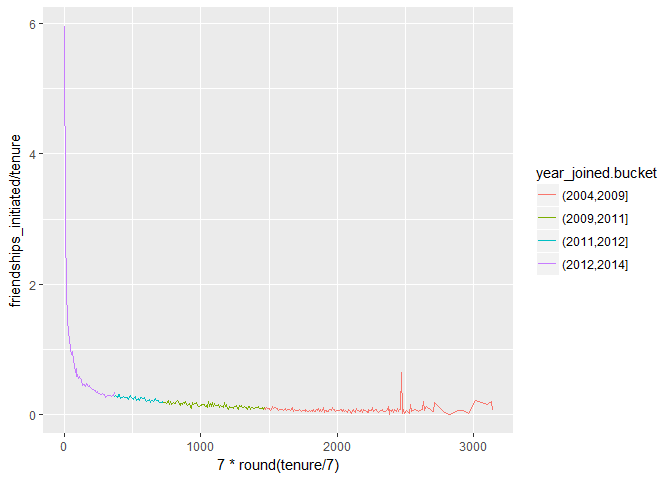<!-- -->

```r
ggplot(aes(x = 30 * round(tenure / 30), y = friendships_initiated / tenure),
       data = subset(pf, tenure > 0)) +
  geom_line(aes(color = year_joined.bucket),
            stat = "summary",
            fun.y = mean)
```

<!-- -->

```r
ggplot(aes(x = 90 * round(tenure / 90), y = friendships_initiated / tenure),
       data = subset(pf, tenure > 0)) +
  geom_line(aes(color = year_joined.bucket),
            stat = "summary",
            fun.y = mean)
```

<!-- -->

***

### Histograms Revisited
Notes:


```r
yo <- read.csv('yogurt.csv')
str(yo)
```

```
## 'data.frame':	2380 obs. of  9 variables:
##  $ obs        : int  1 2 3 4 5 6 7 8 9 10 ...
##  $ id         : int  2100081 2100081 2100081 2100081 2100081 2100081 2100081 2100081 2100081 2100081 ...
##  $ time       : int  9678 9697 9825 9999 10015 10029 10036 10042 10083 10091 ...
##  $ strawberry : int  0 0 0 0 1 1 0 0 0 0 ...
##  $ blueberry  : int  0 0 0 0 0 0 0 0 0 0 ...
##  $ pina.colada: int  0 0 0 0 1 2 0 0 0 0 ...
##  $ plain      : int  0 0 0 0 0 0 0 0 0 0 ...
##  $ mixed.berry: int  1 1 1 1 1 1 1 1 1 1 ...
##  $ price      : num  59 59 65 65 49 ...
```

```r
# Change id from an int to a factor variable
yo$id <- factor(yo$id)
str(yo)
```

```
## 'data.frame':	2380 obs. of  9 variables:
##  $ obs        : int  1 2 3 4 5 6 7 8 9 10 ...
##  $ id         : Factor w/ 332 levels "2100081","2100370",..: 1 1 1 1 1 1 1 1 1 1 ...
##  $ time       : int  9678 9697 9825 9999 10015 10029 10036 10042 10083 10091 ...
##  $ strawberry : int  0 0 0 0 1 1 0 0 0 0 ...
##  $ blueberry  : int  0 0 0 0 0 0 0 0 0 0 ...
##  $ pina.colada: int  0 0 0 0 1 2 0 0 0 0 ...
##  $ plain      : int  0 0 0 0 0 0 0 0 0 0 ...
##  $ mixed.berry: int  1 1 1 1 1 1 1 1 1 1 ...
##  $ price      : num  59 59 65 65 49 ...
```


```r
ggplot(aes(x = price), data = yo) +
  geom_histogram(fill = '#F79420')
```

```
## `stat_bin()` using `bins = 30`. Pick better value with `binwidth`.
```

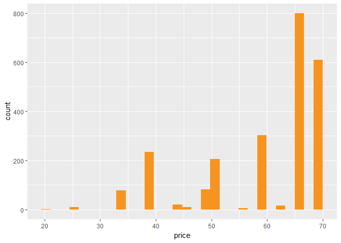<!-- -->

Notes: We see prices in which there are many observations, but then no observations in adjacent prices.

***

### Number of Purchases
Notes: There are 20 distinct prices. By tabling we see the distribution like we saw in the histogram.
How to figure out on a given purchase occasion how many 8 oz yogurts does a household purchase?
To answer this we need to combine accounts of the different yogurt flavors into one variable


```r
summary(yo)
```

```
##       obs               id            time         strawberry     
##  Min.   :   1.0   2132290:  74   Min.   : 9662   Min.   : 0.0000  
##  1st Qu.: 696.5   2130583:  59   1st Qu.: 9843   1st Qu.: 0.0000  
##  Median :1369.5   2124073:  50   Median :10045   Median : 0.0000  
##  Mean   :1367.8   2149500:  50   Mean   :10050   Mean   : 0.6492  
##  3rd Qu.:2044.2   2101790:  47   3rd Qu.:10255   3rd Qu.: 1.0000  
##  Max.   :2743.0   2129528:  39   Max.   :10459   Max.   :11.0000  
##                   (Other):2061                                    
##    blueberry        pina.colada          plain         mixed.berry    
##  Min.   : 0.0000   Min.   : 0.0000   Min.   :0.0000   Min.   :0.0000  
##  1st Qu.: 0.0000   1st Qu.: 0.0000   1st Qu.:0.0000   1st Qu.:0.0000  
##  Median : 0.0000   Median : 0.0000   Median :0.0000   Median :0.0000  
##  Mean   : 0.3571   Mean   : 0.3584   Mean   :0.2176   Mean   :0.3887  
##  3rd Qu.: 0.0000   3rd Qu.: 0.0000   3rd Qu.:0.0000   3rd Qu.:0.0000  
##  Max.   :12.0000   Max.   :10.0000   Max.   :6.0000   Max.   :8.0000  
##                                                                       
##      price      
##  Min.   :20.00  
##  1st Qu.:50.00  
##  Median :65.04  
##  Mean   :59.25  
##  3rd Qu.:68.96  
##  Max.   :68.96  
## 
```

```r
length(unique(yo$price))
```

```
## [1] 20
```

```r
table(yo$price)
```

```
## 
##    20 24.96 33.04  33.2 33.28 33.36 33.52 39.04    44 45.04 48.96 49.52 
##     2    11    54     1     1    22     1   234    21    11    81     1 
##  49.6    50 55.04 58.96    62 63.04 65.04 68.96 
##     1   205     6   303    15     2   799   609
```

Create a new variable called all.purchases, which gives the total counts of yogurt for
each observation or household.

One way to do this is using the transform function. You can look up the function transform
and run the examples of code at the bottom of the documentation to figure out what it does.

The transform function produces a data frame so if you use it then save the result to 'yo'!

OR you can figure out another way to create the variable.


```r
yo <- transform(yo, all.purchases = strawberry + blueberry + pina.colada + plain + mixed.berry)

summary(yo$all.purchases)
```

```
##    Min. 1st Qu.  Median    Mean 3rd Qu.    Max. 
##   1.000   1.000   2.000   1.971   2.000  21.000
```

***

### Prices over Time
Notes:


```r
ggplot(aes(x = all.purchases), data = yo) +
  geom_histogram(binwidth = 1, fill = '#099DD9')
```

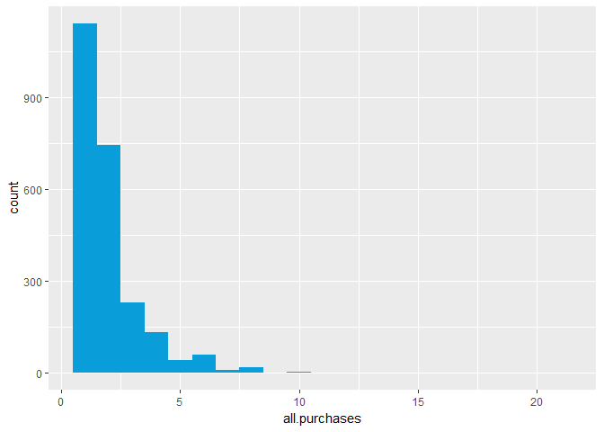<!-- -->

Notes: This histogram reveals that most household buy 1 or 2 yogurts at a time.

Create a scatterplot of price vs time. This will be an example of a time series plot.
Resolve overplotting issues by using techniques you learned in Lesson 4.
What are some things that you notice? 


```r
ggplot(aes(x = time, y = price), data = yo) +
  geom_jitter(alpha = 1/4, shape = 21, fill = I('#F79420'))
```

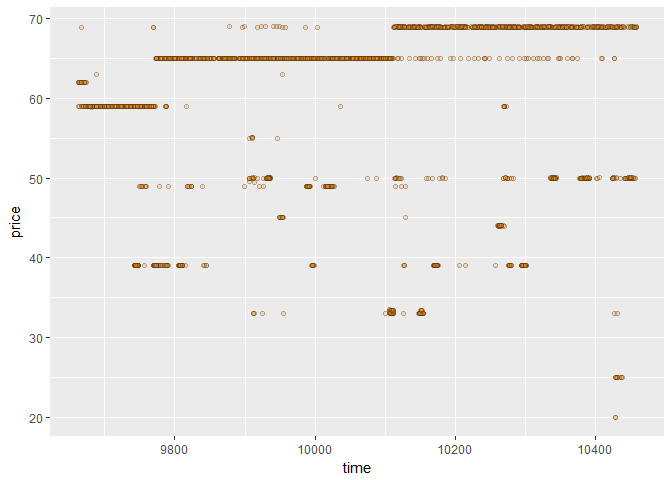<!-- -->

Notes: We can see that the modal or the most common prices seem to be increasing over time.
We also see lower price points scattered across the graph, maybe due to sales perhaps buyers
using coupons that bring down the price of yogurt

***

### Sampling Observations
Notes: You can look at a sample of the population and gain some insight

***

### Looking at Samples of Households
Notes: Using the set seed function to make it reproducible. Sampling from the levels because
those are all the different households. We can plot each purchase occasion for each of the households
that were sampled.


```r
set.seed(4230)
sample.ids <- sample(levels(yo$id), 16)

ggplot(aes(x = time, y = price),
       data = subset(yo, id %in% sample.ids)) +
  facet_wrap( ~ id) +
  geom_line() +
  geom_point(aes(size = all.purchases), pch = 1)
```

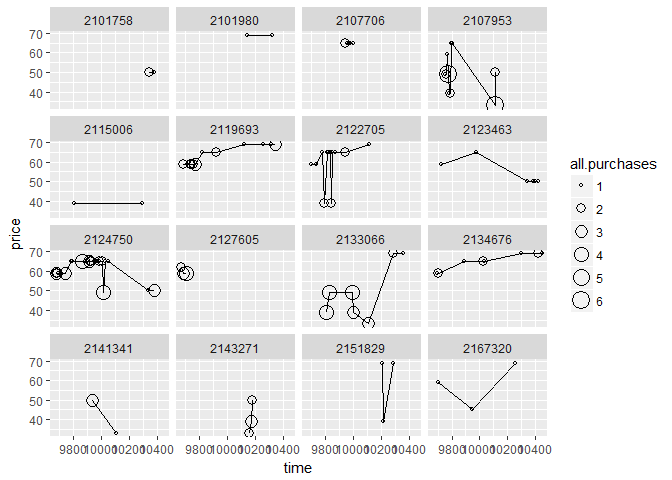<!-- -->

Notes: Used size parameter to add more detail to the plot, passing in the all purchases variable in order
to consider the number of items in terms of size of the point in the plot.

Notes: x %in% y returns a logical (boolean) vector the same length as x that says whether each entry in x appears in y. That is, for each entry in x, it checks to see whether it is in y. This allows us to subset the data so we get all the purchases occasions for the households in the sample. Then, we create scatterplots of price vs. time and facet by the sample id. 


```r
set.seed(7529)
sample.ids1 <- sample(levels(yo$id), 16)

ggplot(aes(x = time, y = price),
       data = subset(yo, id %in% sample.ids1)) +
  facet_wrap( ~ id) +
  geom_line() +
  geom_point(aes(size = all.purchases), pch = 1)
```

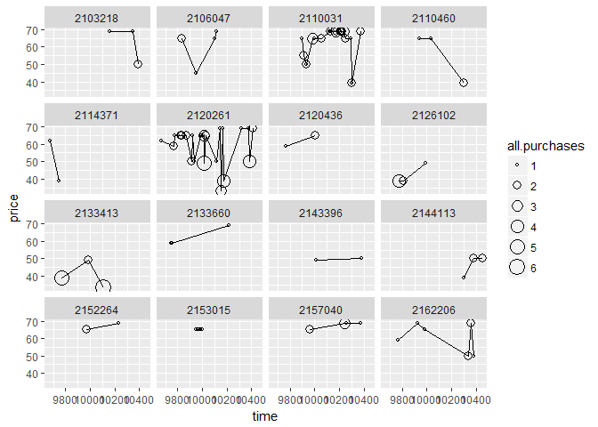<!-- -->

***

### The Limits of Cross Sectional Data
Notes: General idea: if we have observations over time we can facet by the primary unit/case individual of 
the data set. For the yogurt data it was the households that were facetted over. 

***

### Many Variables
Notes:

***

### Scatterplot Matrix
Notes: Can be a useful starting point in many analyses. Can show all correlation coefficients and
previews of plots.


```r
library(GGally)
```

```
## Warning: package 'GGally' was built under R version 3.4.2
```

```
## 
## Attaching package: 'GGally'
```

```
## The following object is masked from 'package:dplyr':
## 
##     nasa
```

```r
theme_set(theme_minimal(20))

set.seed(1836)
pf_subset <- pf[, c(2:15)]
names(pf_subset)
```

```
##  [1] "age"                   "dob_day"              
##  [3] "dob_year"              "dob_month"            
##  [5] "gender"                "tenure"               
##  [7] "friend_count"          "friendships_initiated"
##  [9] "likes"                 "likes_received"       
## [11] "mobile_likes"          "mobile_likes_received"
## [13] "www_likes"             "www_likes_received"
```

```r
pf_subset2 = pf[, c('age', 'dob_year', 'dob_month', 'gender', 'tenure')]
ggpairs(pf_subset2[sample.int(nrow(pf_subset), 1000), ])
```

```
## `stat_bin()` using `bins = 30`. Pick better value with `binwidth`.
```

```
## `stat_bin()` using `bins = 30`. Pick better value with `binwidth`.
## `stat_bin()` using `bins = 30`. Pick better value with `binwidth`.
```

```
## Warning: Removed 2 rows containing non-finite values (stat_boxplot).
```

```
## `stat_bin()` using `bins = 30`. Pick better value with `binwidth`.
```

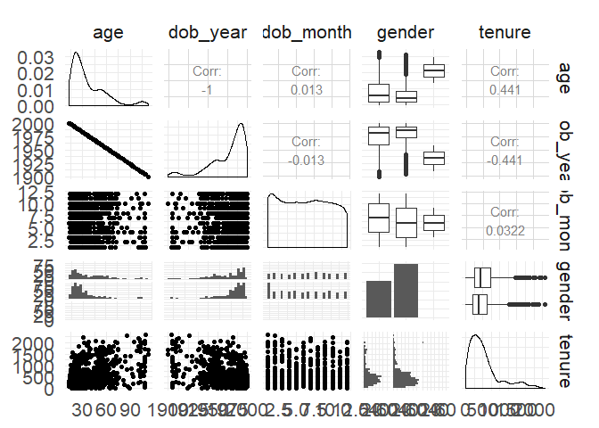<!-- -->

Notes: Scatterplots are below the diagonal, and categorical variables, like gender, create faceted histograms.

You may find in your matrix that variable labels are on the outer edges of the scatterplot matrix, rather than on the diagonal. If you want labels in the diagonal, you can set the axisLabels = 'internal' argument in your ggpairs command.

***

### Even More Variables
Notes:

***

### Heat Maps
Notes:


```r
nci <- read.table("nci.tsv")

# Changing the column names to produce a nicer plot
colnames(nci) <- c(1:64)
```


```r
library(reshape2)
```

```
## Warning: package 'reshape2' was built under R version 3.4.2
```

```
## 
## Attaching package: 'reshape2'
```

```
## The following object is masked from 'package:tidyr':
## 
##     smiths
```

```r
nci.long.samp <- melt(as.matrix(nci[1:200,]))
names(nci.long.samp) <- c("gene", "case", "value")
head(nci.long.samp)
```

```
##   gene case  value
## 1    1    1  0.300
## 2    2    1  1.180
## 3    3    1  0.550
## 4    4    1  1.140
## 5    5    1 -0.265
## 6    6    1 -0.070
```

```r
ggplot(aes(y = gene, x = case, fill = value),
  data = nci.long.samp) +
  geom_tile() +
  scale_fill_gradientn(colours = colorRampPalette(c("blue", "red"))(100))
```

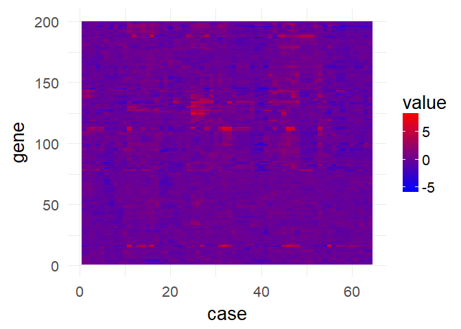<!-- -->


***

### Analyzing Three or More Variables
Reflection: Simple extensions to the scatterplot and plots of conditional summaries, adding summaries
for multiple groups. Tried some techniques for examining large number of variables at once such as
scatter-plot matrices and heat maps. Also learned how to reshape data.

***
