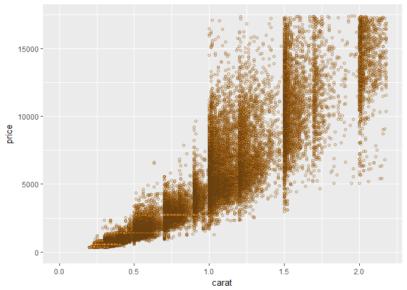
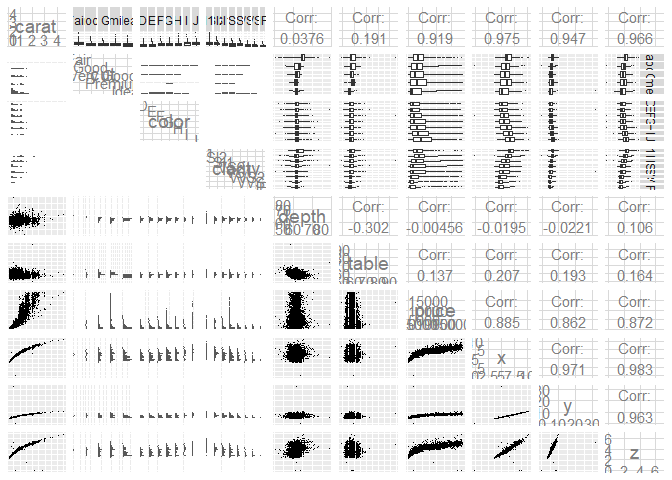
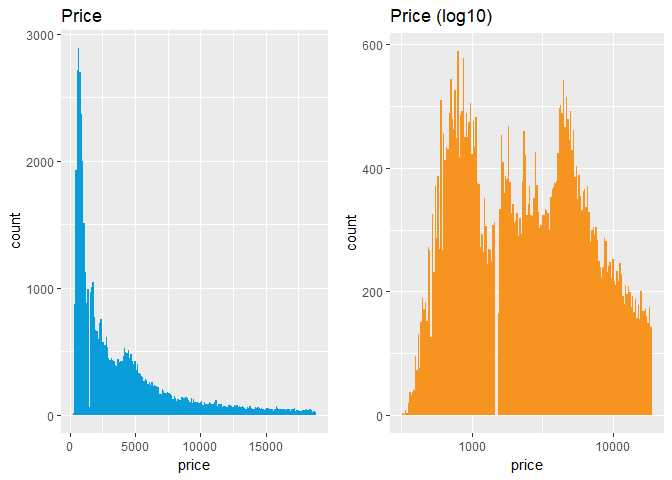
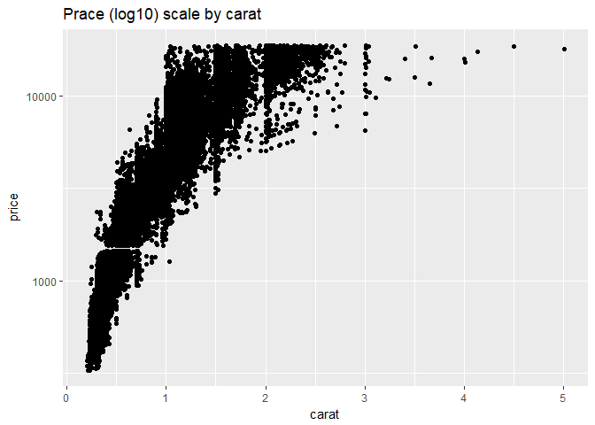
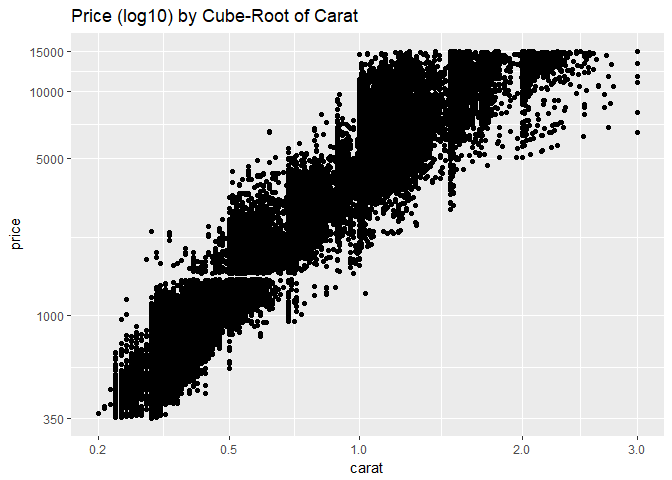
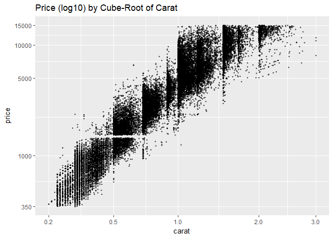
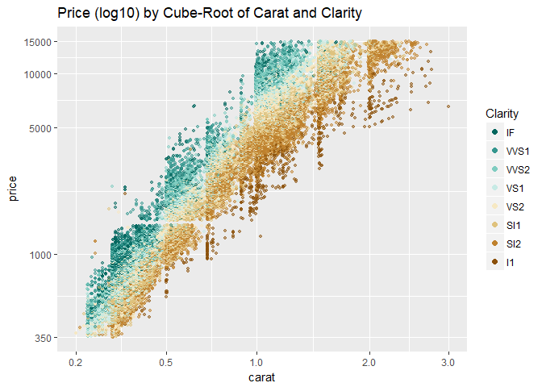
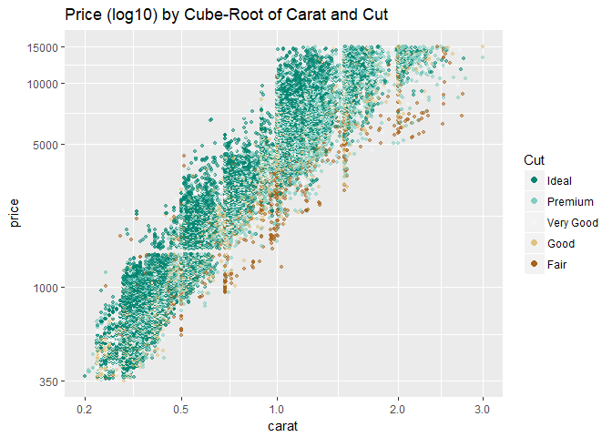
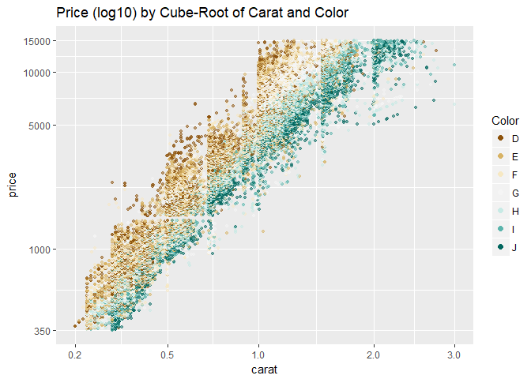

# Diamonds_and_Price_Predictions
Justin Le  
October 26, 2017  


```r
library(ggplot2)
library(gridExtra)
data(diamonds)
```

***

### Scatterplot Review

Let's start by examining two variables in the data set. The scatterplot is a powerful tool to help you understand
the relationship between two continuous variables.

We can quickly see if the relationship is linear or not. In this case, we can use a variety of diamond
characteristics to help us figure out whether the price advertised for any given diamond is 
reasonable or a rip-off.

Let's consider the price of a diamond and it's carat weight. Create a scatterplot of price (y) vs carat weight (x).

Limit the x-axis and y-axis to omit the top 1% of values.


```r
ggplot(aes(x = carat, y = price),
       data = diamonds) +
  geom_point(fill = I('#F79420'), color = I('black'), shape = 21, alpha = 1/4) +
  xlim(0, quantile(diamonds$carat, 0.99)) +
  ylim(0, quantile(diamonds$price, 0.99))
```

```
## Warning: Removed 926 rows containing missing values (geom_point).
```

<!-- -->

```r
#ggplot(aes(x = carat, y = price),
       #data = diamonds) +
  #geom_point(fill = I('#F79420'), color = I('black'), shape = 21) +
  #scale_x_continuous(lim = c(0, quantile(diamonds$carat, 0.99))) +
  #scale_y_continuous(lim = c(0, quantile(diamonds$price, 0.99)))
```

***

### Price and Carat Relationship
What do you notice about the relationship between price and carat?
Response: Nonlinear relationship. Maybe exponential or something else. The dispersion or variance increases
as carat size increases.

***

### Frances Gerety
Notes: A diamond is forever.

***

### The Rise of Diamonds
Notes:

***

### ggpairs Function
Notes:


```r
# load the ggplot graphics package and the others
library(GGally)
```

```
## Warning: package 'GGally' was built under R version 3.4.2
```

```r
library(scales)
```

```
## Warning: package 'scales' was built under R version 3.4.2
```

```r
library(memisc)
```

```
## Warning: package 'memisc' was built under R version 3.4.2
```

```
## Loading required package: lattice
```

```
## Warning: package 'lattice' was built under R version 3.4.2
```

```
## Loading required package: MASS
```

```
## Warning: package 'MASS' was built under R version 3.4.2
```

```
## 
## Attaching package: 'memisc'
```

```
## The following object is masked from 'package:scales':
## 
##     percent
```

```
## The following objects are masked from 'package:stats':
## 
##     contr.sum, contr.treatment, contrasts
```

```
## The following object is masked from 'package:base':
## 
##     as.array
```

```r
library(dplyr)
```

```
## Warning: package 'dplyr' was built under R version 3.4.2
```

```
## 
## Attaching package: 'dplyr'
```

```
## The following objects are masked from 'package:memisc':
## 
##     collect, recode, rename
```

```
## The following object is masked from 'package:MASS':
## 
##     select
```

```
## The following object is masked from 'package:GGally':
## 
##     nasa
```

```
## The following object is masked from 'package:gridExtra':
## 
##     combine
```

```
## The following objects are masked from 'package:stats':
## 
##     filter, lag
```

```
## The following objects are masked from 'package:base':
## 
##     intersect, setdiff, setequal, union
```

```r
# sample 10,000 diamonds from the data set
set.seed(20022012)
diamond_samp <- diamonds[sample(1:length(diamonds$price), 10000), ]
ggpairs(diamond_samp,
  lower = list(continuous = wrap("points", shape = I('.'))),
  upper = list(combo = wrap("box", outlier.shape = I('.'))),
  axisLabels = 'internal')
```

```
## `stat_bin()` using `bins = 30`. Pick better value with `binwidth`.
```

```
## `stat_bin()` using `bins = 30`. Pick better value with `binwidth`.
## `stat_bin()` using `bins = 30`. Pick better value with `binwidth`.
## `stat_bin()` using `bins = 30`. Pick better value with `binwidth`.
## `stat_bin()` using `bins = 30`. Pick better value with `binwidth`.
## `stat_bin()` using `bins = 30`. Pick better value with `binwidth`.
## `stat_bin()` using `bins = 30`. Pick better value with `binwidth`.
## `stat_bin()` using `bins = 30`. Pick better value with `binwidth`.
## `stat_bin()` using `bins = 30`. Pick better value with `binwidth`.
## `stat_bin()` using `bins = 30`. Pick better value with `binwidth`.
## `stat_bin()` using `bins = 30`. Pick better value with `binwidth`.
## `stat_bin()` using `bins = 30`. Pick better value with `binwidth`.
## `stat_bin()` using `bins = 30`. Pick better value with `binwidth`.
## `stat_bin()` using `bins = 30`. Pick better value with `binwidth`.
## `stat_bin()` using `bins = 30`. Pick better value with `binwidth`.
## `stat_bin()` using `bins = 30`. Pick better value with `binwidth`.
## `stat_bin()` using `bins = 30`. Pick better value with `binwidth`.
## `stat_bin()` using `bins = 30`. Pick better value with `binwidth`.
## `stat_bin()` using `bins = 30`. Pick better value with `binwidth`.
## `stat_bin()` using `bins = 30`. Pick better value with `binwidth`.
## `stat_bin()` using `bins = 30`. Pick better value with `binwidth`.
```

<!-- -->

What are some things you notice in the ggpairs output?
Response: The critical factor driving price is the size or the carat weight of the diamond.
Weight ~ f(Volume) ~ f(xyz) -> This suggest we can be especially interested in the cube root
of carat weight. 

***

### The Demand of Diamonds
Notes: It would make sense that the variance in price would increase with carat size.

Link: https://www.r-statistics.com/2013/05/log-transformations-for-skewed-and-wide-distributions-from-practical-data-science-with-r/

Create two histograms of the price variable and place them side by side on one output image.
The first plot should be a histogram of price and the second plot should transform the price variable using log10.
Set appropriate bin widths for each plot. ggtitle() will add a title to each histogram.


```r
p1 <- ggplot(aes(x = price),
       data = diamonds) +
  geom_histogram(binwidth = 100, fill = I('#099DD9')) +
  ggtitle('Price')

p2 <- ggplot(aes(x = price),
       data = diamonds) +
  geom_histogram(binwidth = 0.01, fill = I('#F79420')) +
  scale_x_log10() +
  ggtitle('Price (log10)')

grid.arrange(p1, p2, ncol = 2)
```

<!-- -->

When looking at these plots, what do you notice? Think specifically about the two peaks in the transformed plot and how it relates to the demand for diamonds.

Evidence of bimodality on the log ten scale, which is consistent with our two class rich buyer poor buyer speculation about the nature of customers for diamonds.

***

### Connecting Demand and Price Distributions
Notes:

***

### Scatterplot Transformation


```r
ggplot(aes(x = carat, y = price),
       data = diamonds) +
  geom_point() +
  scale_y_continuous(trans = log10_trans()) +
  ggtitle('Prace (log10) scale by carat')
```

<!-- -->

### Create a new function to transform the carat variable

Link: https://www.youtube.com/watch?v=Z1wB1rHAYzQ&list=PLOU2XLYxmsIK9qQfztXeybpHvru-TrqAP

Notes: Naming the function cuberoot_trans


```r
cuberoot_trans = function() trans_new('cuberoot',
                                      transform = function(x) x^(1/3),
                                      inverse = function(x) x^3)
```

### Use the cuberoot_trans function


```r
ggplot(aes(carat, price), data = diamonds) + 
  geom_point() + 
  scale_x_continuous(trans = cuberoot_trans(), limits = c(0.2, 3),
                     breaks = c(0.2, 0.5, 1, 2, 3)) + 
  scale_y_continuous(trans = log10_trans(), limits = c(350, 15000),
                     breaks = c(350, 1000, 5000, 10000, 15000)) +
  ggtitle('Price (log10) by Cube-Root of Carat')
```

```
## Warning: Removed 1683 rows containing missing values (geom_point).
```

<!-- -->

Notes: Things look almost linear. We can move forward and see about modelling our data using a linear model.

***

### Overplotting Revisited


```r
head(sort(table(diamonds$carat), decreasing = T))
```

```
## 
##  0.3 0.31 1.01  0.7 0.32    1 
## 2604 2249 2242 1981 1840 1558
```

```r
head(sort(table(diamonds$price), decreasing = T))
```

```
## 
## 605 802 625 828 776 698 
## 132 127 126 125 124 121
```

Notes: Ran the table command on carat and price and then sorted them from highest to lowest. The numbers below the carat
and price are count. We can see that these are really high numbers which is going to result in overplotting. So, we can
jitter our points.


```r
ggplot(aes(carat, price), data = diamonds) + 
  geom_point(alpha = 0.5, size = 0.85, position = 'jitter') + 
  scale_x_continuous(trans = cuberoot_trans(), limits = c(0.2, 3),
                     breaks = c(0.2, 0.5, 1, 2, 3)) + 
  scale_y_continuous(trans = log10_trans(), limits = c(350, 15000),
                     breaks = c(350, 1000, 5000, 10000, 15000)) +
  ggtitle('Price (log10) by Cube-Root of Carat')
```

```
## Warning: Removed 1691 rows containing missing values (geom_point).
```

<!-- -->

Notes: After the three adjustments we can see how dense and parse the plot is at key places.

***

### Other Qualitative Factors
Notes:

***

### Price vs. Carat and Clarity

Adjust the code below to color the points by clarity. A layer called scale_color_brewer() has
been added to adjust the legend and provide custom colors.

Link: http://ggplot2.tidyverse.org/reference/scale_brewer.html


```r
# load the RColorBrewer package
library(RColorBrewer)

ggplot(aes(x = carat, y = price), data = diamonds) + 
  geom_point(aes(color = clarity), alpha = 0.5, size = 1, position = 'jitter') +
  scale_color_brewer(type = 'div',
    guide = guide_legend(title = 'Clarity', reverse = T,
    override.aes = list(alpha = 1, size = 2))) +  
  scale_x_continuous(trans = cuberoot_trans(), limits = c(0.2, 3),
    breaks = c(0.2, 0.5, 1, 2, 3)) + 
  scale_y_continuous(trans = log10_trans(), limits = c(350, 15000),
    breaks = c(350, 1000, 5000, 10000, 15000)) +
  ggtitle('Price (log10) by Cube-Root of Carat and Clarity')
```

```
## Warning: Removed 1693 rows containing missing values (geom_point).
```

<!-- -->

Notes: Based on the plot, do you think clarity explains some of the change in price?

You see here that diamonds with lower clarity are always cheaper than those with better
clarity.

***

### Clarity and Price
Response:

***

### Price vs. Carat and Cut

Alter the code below.

```r
ggplot(aes(x = carat, y = price, color = cut), data = diamonds) + 
  geom_point(alpha = 0.5, size = 1, position = 'jitter') +
  scale_color_brewer(type = 'div',
                     guide = guide_legend(title = 'Cut', reverse = T,
                                          override.aes = list(alpha = 1, size = 2))) +  
  scale_x_continuous(trans = cuberoot_trans(), limits = c(0.2, 3),
                     breaks = c(0.2, 0.5, 1, 2, 3)) + 
  scale_y_continuous(trans = log10_trans(), limits = c(350, 15000),
                     breaks = c(350, 1000, 5000, 10000, 15000)) +
  ggtitle('Price (log10) by Cube-Root of Carat and Cut')
```

```
## Warning: Removed 1696 rows containing missing values (geom_point).
```

<!-- -->

Notes: Based on the plot, do you think cut accounts for some of the variance in price?

Not much variation on cut, with ideal being most of the diamonds. Lost the color pattern that we
had before with clarity.

***

### Cut and Price
Response:

***

### Price vs. Carat and Color

Alter the code below.

```r
ggplot(aes(x = carat, y = price, color = color), data = diamonds) + 
  geom_point(alpha = 0.5, size = 1, position = 'jitter') +
  scale_color_brewer(type = 'div',
                     guide = guide_legend(title = 'Color', reverse = F,
                                          override.aes = list(alpha = 1, size = 2))) +  
  scale_x_continuous(trans = cuberoot_trans(), limits = c(0.2, 3),
                     breaks = c(0.2, 0.5, 1, 2, 3)) + 
  scale_y_continuous(trans = log10_trans(), limits = c(350, 15000),
                     breaks = c(350, 1000, 5000, 10000, 15000)) +
  ggtitle('Price (log10) by Cube-Root of Carat and Color')
```

```
## Warning: Removed 1688 rows containing missing values (geom_point).
```

<!-- -->

Notes: Do you think the color influences price?

I think it does, just like we saw with the clarity.

***

### Color and Price
Response:

***

### Linear Models in R
Notes: Price is the outcome variable and carat is the predictor variable. 

***

### Building the Linear Model
Notes: Used the I wrapper, standing for 'as is'. Tells R to transform the variable before using it in the regression.

Link: http://data.princeton.edu/R/linearModels.html


```r
m1 <- lm(I(log(price)) ~ I(carat^(1/3)), data = diamonds)
m2 <- update(m1, ~ . + carat)
m3 <- update(m2, ~ . + cut)
m4 <- update(m3, ~ . + color)
m5 <- update(m4, ~ . + clarity)
mtable(m1, m2, m3, m4, m5)
```

```
## 
## Calls:
## m1: lm(formula = I(log(price)) ~ I(carat^(1/3)), data = diamonds)
## m2: lm(formula = I(log(price)) ~ I(carat^(1/3)) + carat, data = diamonds)
## m3: lm(formula = I(log(price)) ~ I(carat^(1/3)) + carat + cut, data = diamonds)
## m4: lm(formula = I(log(price)) ~ I(carat^(1/3)) + carat + cut + color, 
##     data = diamonds)
## m5: lm(formula = I(log(price)) ~ I(carat^(1/3)) + carat + cut + color + 
##     clarity, data = diamonds)
## 
## ============================================================================================
##                        m1             m2             m3             m4            m5        
## --------------------------------------------------------------------------------------------
##   (Intercept)          2.821***       1.039***       0.874***      0.932***       0.415***  
##                       (0.006)        (0.019)        (0.019)       (0.017)        (0.010)    
##   I(carat^(1/3))       5.558***       8.568***       8.703***      8.438***       9.144***  
##                       (0.007)        (0.032)        (0.031)       (0.028)        (0.016)    
##   carat                              -1.137***      -1.163***     -0.992***      -1.093***  
##                                      (0.012)        (0.011)       (0.010)        (0.006)    
##   cut: .L                                            0.224***      0.224***       0.120***  
##                                                     (0.004)       (0.004)        (0.002)    
##   cut: .Q                                           -0.062***     -0.062***      -0.031***  
##                                                     (0.004)       (0.003)        (0.002)    
##   cut: .C                                            0.051***      0.052***       0.014***  
##                                                     (0.003)       (0.003)        (0.002)    
##   cut: ^4                                            0.018***      0.018***      -0.002     
##                                                     (0.003)       (0.002)        (0.001)    
##   color: .L                                                       -0.373***      -0.441***  
##                                                                   (0.003)        (0.002)    
##   color: .Q                                                       -0.129***      -0.093***  
##                                                                   (0.003)        (0.002)    
##   color: .C                                                        0.001         -0.013***  
##                                                                   (0.003)        (0.002)    
##   color: ^4                                                        0.029***       0.012***  
##                                                                   (0.003)        (0.002)    
##   color: ^5                                                       -0.016***      -0.003*    
##                                                                   (0.003)        (0.001)    
##   color: ^6                                                       -0.023***       0.001     
##                                                                   (0.002)        (0.001)    
##   clarity: .L                                                                     0.907***  
##                                                                                  (0.003)    
##   clarity: .Q                                                                    -0.240***  
##                                                                                  (0.003)    
##   clarity: .C                                                                     0.131***  
##                                                                                  (0.003)    
##   clarity: ^4                                                                    -0.063***  
##                                                                                  (0.002)    
##   clarity: ^5                                                                     0.026***  
##                                                                                  (0.002)    
##   clarity: ^6                                                                    -0.002     
##                                                                                  (0.002)    
##   clarity: ^7                                                                     0.032***  
##                                                                                  (0.001)    
## --------------------------------------------------------------------------------------------
##   R-squared            0.924          0.935          0.939         0.951          0.984     
##   adj. R-squared       0.924          0.935          0.939         0.951          0.984     
##   sigma                0.280          0.259          0.250         0.224          0.129     
##   F               652012.063     387489.366     138654.523     87959.467     173791.084     
##   p                    0.000          0.000          0.000         0.000          0.000     
##   Log-likelihood   -7962.499      -3631.319      -1837.416      4235.240      34091.272     
##   Deviance          4242.831       3613.360       3380.837      2699.212        892.214     
##   AIC              15930.999       7270.637       3690.832     -8442.481     -68140.544     
##   BIC              15957.685       7306.220       3761.997     -8317.942     -67953.736     
##   N                53940          53940          53940         53940          53940         
## ============================================================================================
```

We're getting some nice R-squared values. 

Notice how adding cut to our model does not help explain much of the variance
in the price of diamonds. This fits with out exploration earlier.

***

### Model Problems
Video Notes: What could be some problems when using this model? What else should we think about when using
this model?

2008 -> 2014
- inflation
- 2008 global recession
- diamond market in China heating up
- uneven recorvery/price increase across different carat weight

Research:
(Take some time to come up with 2-4 problems for the model)
(You should 10-20 min on this)

***

### A Bigger, Better Data Set
Notes:


```r
library('bitops')
library('RCurl')

#diamondsurl = getBinaryURL("diamonds-data/BigDiamonds.Rda")
#load(rawConnection(diamondsurl))
diamondsbig <- read.csv('diamondsbig.csv')
```

The code used to obtain the data is available here:
https://github.com/solomonm/diamonds-data

### Building a Model Using the Big Diamonds Data Set

Your task is to build five linear models like Solomon did for the diamonds data set only this
me you'll use a sample of diamonds from the diamondsbig data set.

Be sure to make use of the same variables (logprice, carat, etc.) and model names (m1, m2, m3, m4, m5).

To get the diamondsbig data into RStudio on your machine, copy, paste, and run the
code in the Instructor Notes. There's 598,024 diamonds in this data set!

Since the data set is so large, you are going to use a sample of the data set to compute the models. You can use
the entire data set on your machine which will produce slightly different coefficients and statistics for the models.


```r
diamondsbig$logprice <- log(diamondsbig$price)
m1 <- lm(logprice ~ I(carat^(1/3)),
         data = diamondsbig[diamondsbig$price < 10000 &
                              diamondsbig$cert == "GIA",])
m2 <- update(m1, ~ . + carat)
m3 <- update(m2, ~ . + cut)
m4 <- update(m3, ~ . + color)
m5 <- update(m4, ~ . + clarity)
mtable(m1, m2, m3, m4, m5)
```

```
## 
## Calls:
## m1: lm(formula = logprice ~ I(carat^(1/3)), data = diamondsbig[diamondsbig$price < 
##     10000 & diamondsbig$cert == "GIA", ])
## m2: lm(formula = logprice ~ I(carat^(1/3)) + carat, data = diamondsbig[diamondsbig$price < 
##     10000 & diamondsbig$cert == "GIA", ])
## m3: lm(formula = logprice ~ I(carat^(1/3)) + carat + cut, data = diamondsbig[diamondsbig$price < 
##     10000 & diamondsbig$cert == "GIA", ])
## m4: lm(formula = logprice ~ I(carat^(1/3)) + carat + cut + color, 
##     data = diamondsbig[diamondsbig$price < 10000 & diamondsbig$cert == 
##         "GIA", ])
## m5: lm(formula = logprice ~ I(carat^(1/3)) + carat + cut + color + 
##     clarity, data = diamondsbig[diamondsbig$price < 10000 & diamondsbig$cert == 
##     "GIA", ])
## 
## ================================================================================================
##                         m1              m2             m3             m4              m5        
## ------------------------------------------------------------------------------------------------
##   (Intercept)           2.671***        1.333***       0.949***       1.341***        0.665***  
##                        (0.003)         (0.012)        (0.012)        (0.010)         (0.007)    
##   I(carat^(1/3))        5.839***        8.243***       8.633***       8.110***        8.320***  
##                        (0.004)         (0.022)        (0.021)        (0.017)         (0.012)    
##   carat                                -1.061***      -1.223***      -0.782***       -0.763***  
##                                        (0.009)        (0.009)        (0.007)         (0.005)    
##   cut: Ideal                                           0.211***       0.181***        0.131***  
##                                                       (0.002)        (0.001)         (0.001)    
##   cut: V.Good                                          0.120***       0.090***        0.071***  
##                                                       (0.002)        (0.001)         (0.001)    
##   color: E/D                                                         -0.083***       -0.071***  
##                                                                      (0.001)         (0.001)    
##   color: F/D                                                         -0.125***       -0.105***  
##                                                                      (0.001)         (0.001)    
##   color: G/D                                                         -0.178***       -0.162***  
##                                                                      (0.001)         (0.001)    
##   color: H/D                                                         -0.243***       -0.225***  
##                                                                      (0.002)         (0.001)    
##   color: I/D                                                         -0.361***       -0.358***  
##                                                                      (0.002)         (0.001)    
##   color: J/D                                                         -0.500***       -0.509***  
##                                                                      (0.002)         (0.001)    
##   color: K/D                                                         -0.689***       -0.710***  
##                                                                      (0.002)         (0.002)    
##   color: L/D                                                         -0.812***       -0.827***  
##                                                                      (0.003)         (0.002)    
##   clarity: I2                                                                        -0.301***  
##                                                                                      (0.006)    
##   clarity: IF                                                                         0.751***  
##                                                                                      (0.002)    
##   clarity: SI1                                                                        0.426***  
##                                                                                      (0.002)    
##   clarity: SI2                                                                        0.306***  
##                                                                                      (0.002)    
##   clarity: VS1                                                                        0.590***  
##                                                                                      (0.002)    
##   clarity: VS2                                                                        0.534***  
##                                                                                      (0.002)    
##   clarity: VVS1                                                                       0.693***  
##                                                                                      (0.002)    
##   clarity: VVS2                                                                       0.633***  
##                                                                                      (0.002)    
## ------------------------------------------------------------------------------------------------
##   R-squared             0.888           0.892          0.899          0.937           0.969     
##   adj. R-squared        0.888           0.892          0.899          0.937           0.969     
##   sigma                 0.289           0.284          0.275          0.216           0.154     
##   F               2700903.714     1406538.330     754405.425     423311.488      521161.443     
##   p                     0.000           0.000          0.000          0.000           0.000     
##   Log-likelihood   -60137.791      -53996.269     -43339.818      37830.414      154124.270     
##   Deviance          28298.689       27291.534      25628.285      15874.910        7992.720     
##   AIC              120281.582      108000.539      86691.636     -75632.827     -308204.540     
##   BIC              120313.783      108043.473      86756.037     -75482.557     -307968.400     
##   N                338946          338946         338946         338946          338946         
## ================================================================================================
```

Notes: Similar to the smaller diamonds data set, although R-squared values are a little weaker.

***

## Predictions

Example Diamond from BlueNile:
Round 1.00 Very Good I VS1 $5,601


```r
#Be sure you’ve loaded the library memisc and have m5 saved as an object in your workspace.
thisDiamond = data.frame(carat = 1.00, cut = "V.Good",
                         color = "I", clarity = "VS1")
modelEstimate = predict(m5, newdata = thisDiamond,
                        interval="prediction", level = .95)

exp(modelEstimate)
```

```
##        fit     lwr      upr
## 1 5040.436 3730.34 6810.638
```

Evaluate how well the model predicts the BlueNile diamond's price. Think about the fitted point estimate as well as the 95% CI.

***

## Final Thoughts
Notes:

***
