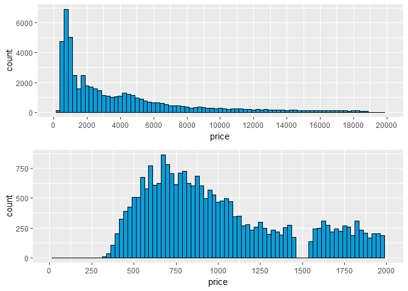
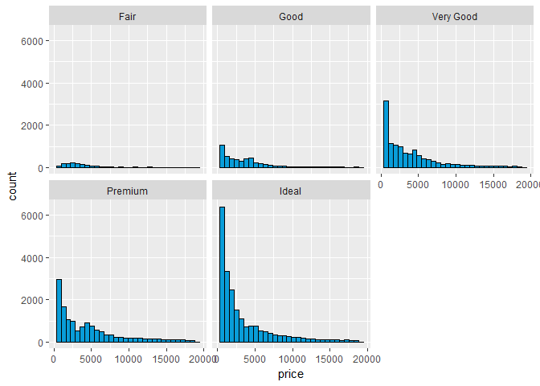
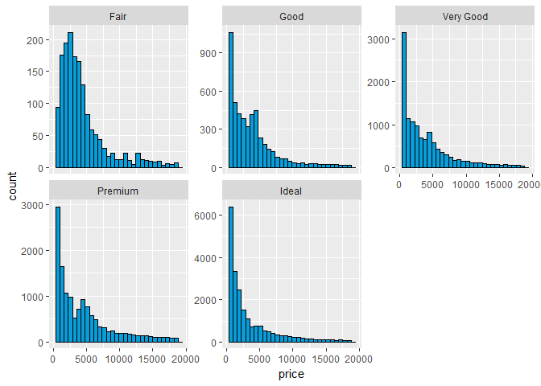
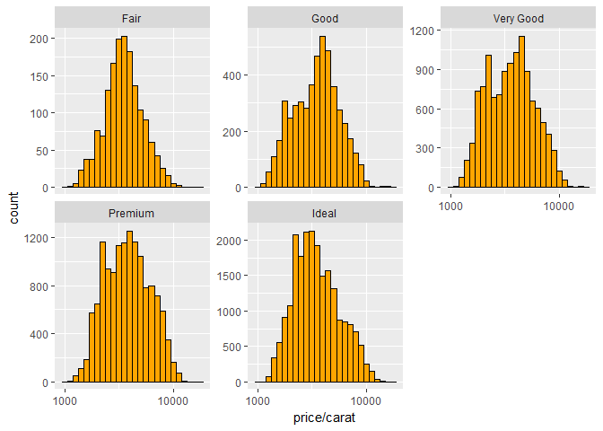
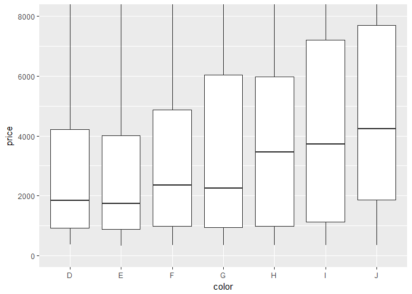
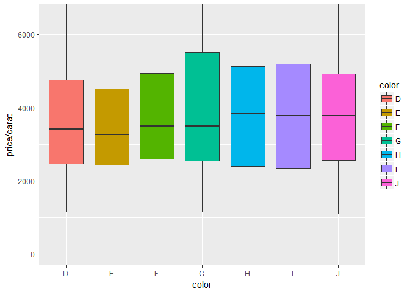
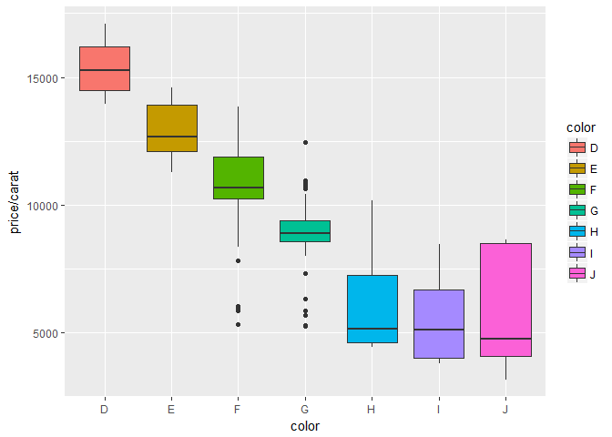
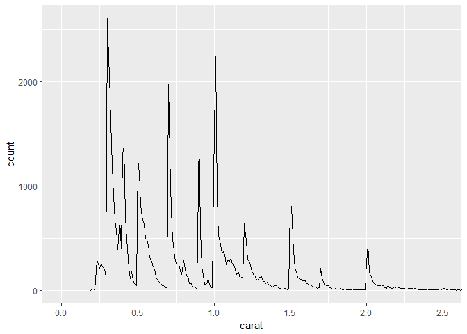

# Explore One Variable Problem Set
Justin Le  
October 26, 2017  


```r
library(ggplot2)
library(gridExtra)
data("diamonds")
summary(diamonds)
```

```
##      carat               cut        color        clarity     
##  Min.   :0.2000   Fair     : 1610   D: 6775   SI1    :13065  
##  1st Qu.:0.4000   Good     : 4906   E: 9797   VS2    :12258  
##  Median :0.7000   Very Good:12082   F: 9542   SI2    : 9194  
##  Mean   :0.7979   Premium  :13791   G:11292   VS1    : 8171  
##  3rd Qu.:1.0400   Ideal    :21551   H: 8304   VVS2   : 5066  
##  Max.   :5.0100                     I: 5422   VVS1   : 3655  
##                                     J: 2808   (Other): 2531  
##      depth           table           price             x         
##  Min.   :43.00   Min.   :43.00   Min.   :  326   Min.   : 0.000  
##  1st Qu.:61.00   1st Qu.:56.00   1st Qu.:  950   1st Qu.: 4.710  
##  Median :61.80   Median :57.00   Median : 2401   Median : 5.700  
##  Mean   :61.75   Mean   :57.46   Mean   : 3933   Mean   : 5.731  
##  3rd Qu.:62.50   3rd Qu.:59.00   3rd Qu.: 5324   3rd Qu.: 6.540  
##  Max.   :79.00   Max.   :95.00   Max.   :18823   Max.   :10.740  
##                                                                  
##        y                z         
##  Min.   : 0.000   Min.   : 0.000  
##  1st Qu.: 4.720   1st Qu.: 2.910  
##  Median : 5.710   Median : 3.530  
##  Mean   : 5.735   Mean   : 3.539  
##  3rd Qu.: 6.540   3rd Qu.: 4.040  
##  Max.   :58.900   Max.   :31.800  
## 
```

***

### Looking into the peak


```r
p1 <- ggplot(aes(x = price), data = diamonds) +
  geom_histogram(binwidth = 250, color = I('black'), fill = I('#099DD9')) +
  scale_x_continuous(limits = c(0, 20000), breaks = seq(0, 20000, 2000))

p2 <- ggplot(aes(x = price), data = diamonds) +
  geom_histogram(binwidth = 25, color = I('black'), fill = I('#099DD9')) +
  scale_x_continuous(limits = c(0, 2000), breaks = seq(0, 2000, 250))

grid.arrange(p1, p2, ncol = 1)
```

```
## Warning: Removed 29733 rows containing non-finite values (stat_bin).
```

<!-- -->


```r
summary(diamonds$price)
```

```
##    Min. 1st Qu.  Median    Mean 3rd Qu.    Max. 
##     326     950    2401    3933    5324   18823
```

```r
subset(diamonds, price < 500)
```

```
## # A tibble: 1,729 x 10
##    carat       cut color clarity depth table price     x     y     z
##    <dbl>     <ord> <ord>   <ord> <dbl> <dbl> <int> <dbl> <dbl> <dbl>
##  1  0.23     Ideal     E     SI2  61.5    55   326  3.95  3.98  2.43
##  2  0.21   Premium     E     SI1  59.8    61   326  3.89  3.84  2.31
##  3  0.23      Good     E     VS1  56.9    65   327  4.05  4.07  2.31
##  4  0.29   Premium     I     VS2  62.4    58   334  4.20  4.23  2.63
##  5  0.31      Good     J     SI2  63.3    58   335  4.34  4.35  2.75
##  6  0.24 Very Good     J    VVS2  62.8    57   336  3.94  3.96  2.48
##  7  0.24 Very Good     I    VVS1  62.3    57   336  3.95  3.98  2.47
##  8  0.26 Very Good     H     SI1  61.9    55   337  4.07  4.11  2.53
##  9  0.22      Fair     E     VS2  65.1    61   337  3.87  3.78  2.49
## 10  0.23 Very Good     H     VS1  59.4    61   338  4.00  4.05  2.39
## # ... with 1,719 more rows
```

```r
subset(diamonds, price < 250)
```

```
## # A tibble: 0 x 10
## # ... with 10 variables: carat <dbl>, cut <ord>, color <ord>,
## #   clarity <ord>, depth <dbl>, table <dbl>, price <int>, x <dbl>,
## #   y <dbl>, z <dbl>
```

```r
nrow(subset(diamonds, price >= 15000))
```

```
## [1] 1656
```
***

### Histogram of diamond prices by cut


```r
ggplot(aes(x = price), data = diamonds) +
  geom_histogram(color = I('black'), fill = I('#099DD9')) +
  facet_wrap(~cut)
```

```
## `stat_bin()` using `bins = 30`. Pick better value with `binwidth`.
```

<!-- -->

***

### Price by cut questions:
Which cut has the highest priced diamond? Premium
Which cut has the lowest priced diamond? Premium, Ideal
Which cut has the lowest median price? Ideal


```r
by(diamonds$price, diamonds$cut, summary)
```

```
## diamonds$cut: Fair
##    Min. 1st Qu.  Median    Mean 3rd Qu.    Max. 
##     337    2050    3282    4359    5206   18574 
## -------------------------------------------------------- 
## diamonds$cut: Good
##    Min. 1st Qu.  Median    Mean 3rd Qu.    Max. 
##     327    1145    3050    3929    5028   18788 
## -------------------------------------------------------- 
## diamonds$cut: Very Good
##    Min. 1st Qu.  Median    Mean 3rd Qu.    Max. 
##     336     912    2648    3982    5373   18818 
## -------------------------------------------------------- 
## diamonds$cut: Premium
##    Min. 1st Qu.  Median    Mean 3rd Qu.    Max. 
##     326    1046    3185    4584    6296   18823 
## -------------------------------------------------------- 
## diamonds$cut: Ideal
##    Min. 1st Qu.  Median    Mean 3rd Qu.    Max. 
##     326     878    1810    3458    4678   18806
```

```r
tapply(diamonds$price, diamonds$cut, max)
```

```
##      Fair      Good Very Good   Premium     Ideal 
##     18574     18788     18818     18823     18806
```

```r
tapply(diamonds$price, diamonds$cut, min)
```

```
##      Fair      Good Very Good   Premium     Ideal 
##       337       327       336       326       326
```

```r
tapply(diamonds$price, diamonds$cut, median)
```

```
##      Fair      Good Very Good   Premium     Ideal 
##    3282.0    3050.5    2648.0    3185.0    1810.0
```

***

### Don't want y-axis to be fixed


```r
ggplot(aes(x = price), data = diamonds) +
  geom_histogram(color = I('black'), fill = I('#099DD9')) +
  facet_wrap(~cut, scales = "free_y")
```

```
## `stat_bin()` using `bins = 30`. Pick better value with `binwidth`.
```

<!-- -->

***

### Histograms of price per carat and facet it by cut


```r
ggplot(aes(x = price/carat), data = diamonds) +
  geom_histogram(binwidth = 0.05, color = I('black'), fill = I('#FFA500')) +
  scale_x_log10() +
  facet_wrap(~cut, scales = "free_y")
```

<!-- -->

***

### Investigate the price of diamonds using box plots,
numerical summaries, and one of the following categorical
variables: cut, clarity, or color.


```r
ggplot(aes(x = color, y = price), data = diamonds) +
  geom_boxplot() +
  coord_cartesian(ylim = c(0, 8000))
```

<!-- -->


```r
by(diamonds$price, diamonds$color, summary)
```

```
## diamonds$color: D
##    Min. 1st Qu.  Median    Mean 3rd Qu.    Max. 
##     357     911    1838    3170    4214   18693 
## -------------------------------------------------------- 
## diamonds$color: E
##    Min. 1st Qu.  Median    Mean 3rd Qu.    Max. 
##     326     882    1739    3077    4003   18731 
## -------------------------------------------------------- 
## diamonds$color: F
##    Min. 1st Qu.  Median    Mean 3rd Qu.    Max. 
##     342     982    2344    3725    4868   18791 
## -------------------------------------------------------- 
## diamonds$color: G
##    Min. 1st Qu.  Median    Mean 3rd Qu.    Max. 
##     354     931    2242    3999    6048   18818 
## -------------------------------------------------------- 
## diamonds$color: H
##    Min. 1st Qu.  Median    Mean 3rd Qu.    Max. 
##     337     984    3460    4487    5980   18803 
## -------------------------------------------------------- 
## diamonds$color: I
##    Min. 1st Qu.  Median    Mean 3rd Qu.    Max. 
##     334    1120    3730    5092    7202   18823 
## -------------------------------------------------------- 
## diamonds$color: J
##    Min. 1st Qu.  Median    Mean 3rd Qu.    Max. 
##     335    1860    4234    5324    7695   18710
```

What is the IQR for the best color? 3302.5
IQR for the worst?


```r
IQR(subset(diamonds, color == 'D')$price)
```

```
## [1] 3302.5
```

```r
IQR(subset(diamonds, color == 'J')$price)
```

```
## [1] 5834.5
```

***
### Investigate the price per carat of diamonds across
the different colors of diamonds using boxplots.


```r
ggplot(aes(x = color, y = price/carat, fill = color), data = diamonds) +
  geom_boxplot() +
  coord_cartesian(ylim = c(0, 6500))
```

<!-- -->


```r
by(diamonds$price/diamonds$carat, diamonds$color, summary)
```

```
## diamonds$color: D
##    Min. 1st Qu.  Median    Mean 3rd Qu.    Max. 
##    1128    2455    3411    3953    4749   17829 
## -------------------------------------------------------- 
## diamonds$color: E
##    Min. 1st Qu.  Median    Mean 3rd Qu.    Max. 
##    1078    2430    3254    3805    4508   14609 
## -------------------------------------------------------- 
## diamonds$color: F
##    Min. 1st Qu.  Median    Mean 3rd Qu.    Max. 
##    1168    2587    3494    4135    4947   13861 
## -------------------------------------------------------- 
## diamonds$color: G
##    Min. 1st Qu.  Median    Mean 3rd Qu.    Max. 
##    1139    2538    3490    4163    5500   12461 
## -------------------------------------------------------- 
## diamonds$color: H
##    Min. 1st Qu.  Median    Mean 3rd Qu.    Max. 
##    1051    2397    3819    4008    5127   10188 
## -------------------------------------------------------- 
## diamonds$color: I
##    Min. 1st Qu.  Median    Mean 3rd Qu.    Max. 
##    1152    2345    3780    3996    5197    9398 
## -------------------------------------------------------- 
## diamonds$color: J
##    Min. 1st Qu.  Median    Mean 3rd Qu.    Max. 
##    1081    2563    3780    3826    4928    8647
```

Look what happens when we look at only the heavier (greater than median carat) diamonds with the best cut and best clarity. This is more what we would expect, as color gets worse price per carat decreases. The reason for this maybe because people are will to pay more for bigger diamond even if they have a bad cut, bad clarity and bad color. 
Agree?? Disagree?? 
Wow, over $15,000 per carat for a diamond with the best cut, clarity and color!


```r
uniform <- subset(diamonds, cut == "Ideal" & clarity == "IF" & carat > 0.7)
qplot(x = color, y = price/carat, data = uniform, geom = "boxplot", fill = color)
```

<!-- -->

***

### Investigate the weight (carat) of the diamonds using a frequency polygon. Use
different binwidths to see how the frequency changes. 


```r
ggplot(aes(x = carat), data = diamonds) +
  geom_freqpoly(binwidth = 0.01) +
  coord_cartesian(xlim = c(0, 2.5))
```

<!-- -->

### What carat size has a count greater than 2000?


```r
table(diamonds$carat)
```

```
## 
##  0.2 0.21 0.22 0.23 0.24 0.25 0.26 0.27 0.28 0.29  0.3 0.31 0.32 0.33 0.34 
##   12    9    5  293  254  212  253  233  198  130 2604 2249 1840 1189  910 
## 0.35 0.36 0.37 0.38 0.39  0.4 0.41 0.42 0.43 0.44 0.45 0.46 0.47 0.48 0.49 
##  667  572  394  670  398 1299 1382  706  488  212  110  178   99   63   45 
##  0.5 0.51 0.52 0.53 0.54 0.55 0.56 0.57 0.58 0.59  0.6 0.61 0.62 0.63 0.64 
## 1258 1127  817  709  625  496  492  430  310  282  228  204  135  102   80 
## 0.65 0.66 0.67 0.68 0.69  0.7 0.71 0.72 0.73 0.74 0.75 0.76 0.77 0.78 0.79 
##   65   48   48   25   26 1981 1294  764  492  322  249  251  251  187  155 
##  0.8 0.81 0.82 0.83 0.84 0.85 0.86 0.87 0.88 0.89  0.9 0.91 0.92 0.93 0.94 
##  284  200  140  131   64   62   34   31   23   21 1485  570  226  142   59 
## 0.95 0.96 0.97 0.98 0.99    1 1.01 1.02 1.03 1.04 1.05 1.06 1.07 1.08 1.09 
##   65  103   59   31   23 1558 2242  883  523  475  361  373  342  246  287 
##  1.1 1.11 1.12 1.13 1.14 1.15 1.16 1.17 1.18 1.19  1.2 1.21 1.22 1.23 1.24 
##  278  308  251  246  207  149  172  110  123  126  645  473  300  279  236 
## 1.25 1.26 1.27 1.28 1.29  1.3 1.31 1.32 1.33 1.34 1.35 1.36 1.37 1.38 1.39 
##  187  146  134  106  101  122  133   89   87   68   77   50   46   26   36 
##  1.4 1.41 1.42 1.43 1.44 1.45 1.46 1.47 1.48 1.49  1.5 1.51 1.52 1.53 1.54 
##   50   40   25   19   18   15   18   21    7   11  793  807  381  220  174 
## 1.55 1.56 1.57 1.58 1.59  1.6 1.61 1.62 1.63 1.64 1.65 1.66 1.67 1.68 1.69 
##  124  109  106   89   89   95   64   61   50   43   32   30   25   19   24 
##  1.7 1.71 1.72 1.73 1.74 1.75 1.76 1.77 1.78 1.79  1.8 1.81 1.82 1.83 1.84 
##  215  119   57   52   40   50   28   17   12   15   21    9   13   18    4 
## 1.85 1.86 1.87 1.88 1.89  1.9 1.91 1.92 1.93 1.94 1.95 1.96 1.97 1.98 1.99 
##    3    9    7    4    4    7   12    2    6    3    3    4    4    5    3 
##    2 2.01 2.02 2.03 2.04 2.05 2.06 2.07 2.08 2.09  2.1 2.11 2.12 2.13 2.14 
##  265  440  177  122   86   67   60   50   41   45   52   43   25   21   48 
## 2.15 2.16 2.17 2.18 2.19  2.2 2.21 2.22 2.23 2.24 2.25 2.26 2.27 2.28 2.29 
##   22   25   18   31   22   32   23   27   13   16   18   15   12   20   17 
##  2.3 2.31 2.32 2.33 2.34 2.35 2.36 2.37 2.38 2.39  2.4 2.41 2.42 2.43 2.44 
##   21   13   16    9    5    7    8    6    8    7   13    5    8    6    4 
## 2.45 2.46 2.47 2.48 2.49  2.5 2.51 2.52 2.53 2.54 2.55 2.56 2.57 2.58 2.59 
##    4    3    3    9    3   17   17    9    8    9    3    3    3    3    1 
##  2.6 2.61 2.63 2.64 2.65 2.66 2.67 2.68  2.7 2.71 2.72 2.74 2.75 2.77  2.8 
##    3    3    3    1    1    3    1    2    1    1    3    3    2    1    2 
##    3 3.01 3.02 3.04 3.05 3.11 3.22 3.24  3.4  3.5 3.51 3.65 3.67    4 4.01 
##    8   14    1    2    1    1    1    1    1    1    1    1    1    1    2 
## 4.13  4.5 5.01 
##    1    1    1
```

You can save images by using the ggsave() command.
ggsave() will save the last plot created.
For example...
                 qplot(x = price, data = diamonds)
                 ggsave('priceHistogram.png')

ggsave currently recognises the extensions eps/ps, tex (pictex),
pdf, jpeg, tiff, png, bmp, svg and wmf (windows only).

***
