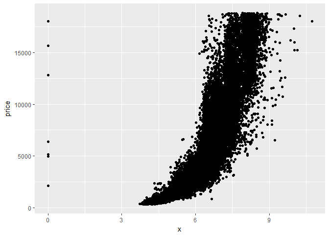
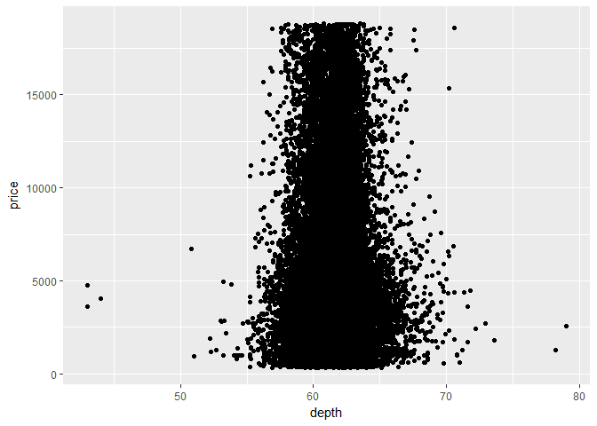
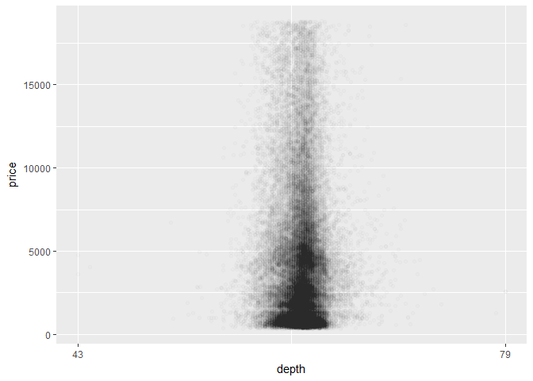
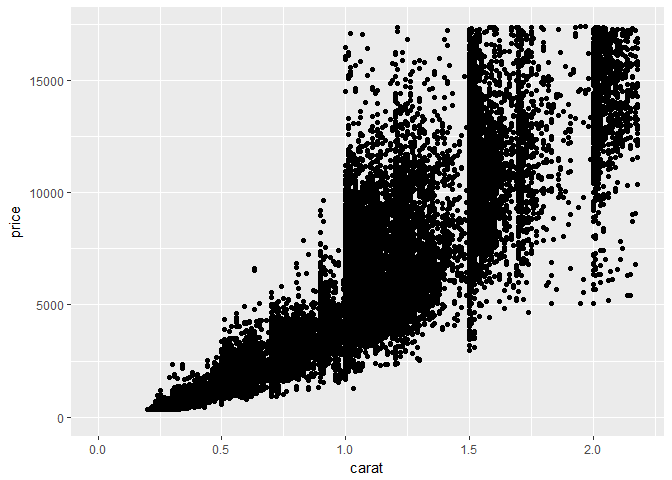
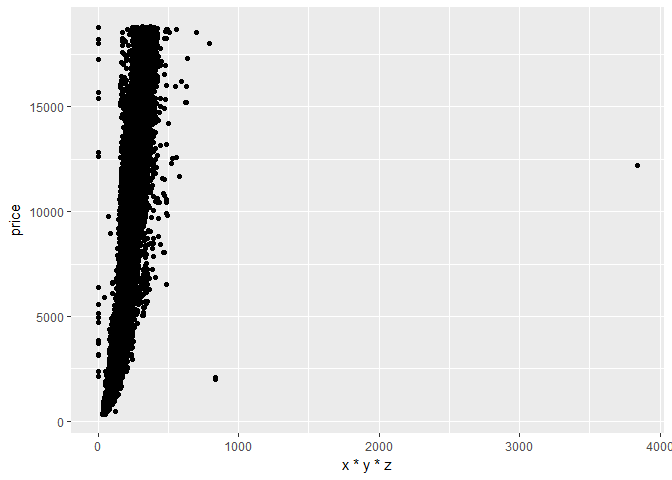
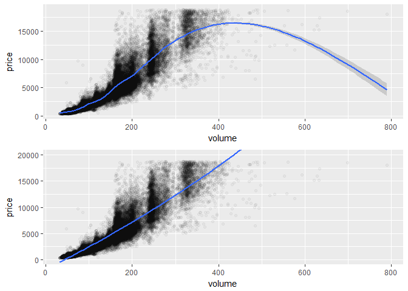
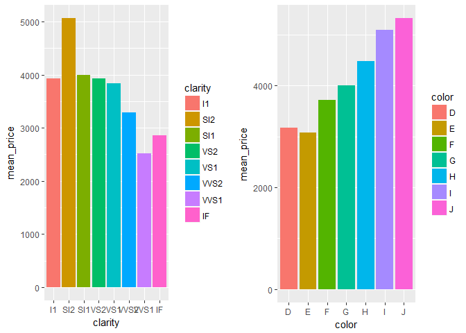
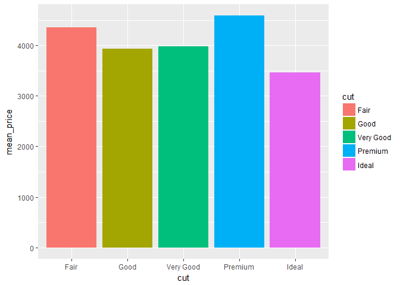

# Explore One Variable Problem Set
Justin Le  
October 26, 2017  


***

In this problem set, you'll continue to explore the diamonds data set.


```r
library(ggplot2)
library(gridExtra)

data(diamonds)
```

Your first task is to create a scatterplot of price vs x. using the ggplot syntax.


```r
ggplot(aes(x = x, y = price), data = diamonds) +
  geom_point()
```

<!-- -->

Notes: The plot looks exponential. There are also thos with 0 for x which is strange.

***

What is the correlation between price and x? 0.884
What is the correlation between price and y? 0.865
What is the correlation between price and z? 0.861


```r
with(diamonds, cor.test(price, x, method = 'pearson'))
```

```
## 
## 	Pearson's product-moment correlation
## 
## data:  price and x
## t = 440.16, df = 53938, p-value < 2.2e-16
## alternative hypothesis: true correlation is not equal to 0
## 95 percent confidence interval:
##  0.8825835 0.8862594
## sample estimates:
##       cor 
## 0.8844352
```

```r
with(diamonds, cor.test(price, y, method = 'pearson'))
```

```
## 
## 	Pearson's product-moment correlation
## 
## data:  price and y
## t = 401.14, df = 53938, p-value < 2.2e-16
## alternative hypothesis: true correlation is not equal to 0
## 95 percent confidence interval:
##  0.8632867 0.8675241
## sample estimates:
##       cor 
## 0.8654209
```

```r
with(diamonds, cor.test(price, z, method = 'pearson'))
```

```
## 
## 	Pearson's product-moment correlation
## 
## data:  price and z
## t = 393.6, df = 53938, p-value < 2.2e-16
## alternative hypothesis: true correlation is not equal to 0
## 95 percent confidence interval:
##  0.8590541 0.8634131
## sample estimates:
##       cor 
## 0.8612494
```

Notes: The correlation between price and all x, y, and z is a strong positive relationship from 0.86 to 0.88.

### Scatter plot of price vs depth.


```r
ggplot(aes(x = depth, y = price), data = diamonds) +
  geom_point()
```

<!-- -->

Change the code to make the transparency of the points to be 1/100 of what they are now and mark
the x-axis every 2 units.


```r
ggplot(aes(x = depth, y = price), data = diamonds) +
  geom_point(alpha = 1/100) +
  scale_x_continuous(breaks = c(43, 79, 2))
```

<!-- -->

Notes: Based on the scatterplot of depth vs price, most diamonds are between 57 and 66.
PROBLEM! Need to figure out how to put tick marks on the graph.

***

What's the correlation of depth vs. price?
Based on the correlation coefficient, would you use depth to predict the price of a diamond?


```r
with(diamonds, cor.test(depth, price, method = 'pearson'))
```

```
## 
## 	Pearson's product-moment correlation
## 
## data:  depth and price
## t = -2.473, df = 53938, p-value = 0.0134
## alternative hypothesis: true correlation is not equal to 0
## 95 percent confidence interval:
##  -0.019084756 -0.002208537
## sample estimates:
##        cor 
## -0.0106474
```

Notes: Correlation coefficient of -0.011, I would not use depth to predict the price of a diamond
because the coefficient shows a weak relationship between the two variables.

***

Create a scatterplot of price vs carat and omit the top 1% of price and carat values.


```r
ggplot(aes(x = carat, y = price), data = diamonds) +
  geom_point() +
  xlim(0, quantile(diamonds$carat, 0.99)) +
  ylim(0, quantile(diamonds$price, 0.99))
```

```
## Warning: Removed 926 rows containing missing values (geom_point).
```

<!-- -->

***

Create a scatterplot of price vs. volume (x * y * z).
This is a very rough approximation for a diamond's volume.

Create a new variable for volume in the diamonds data frame.
This will be useful in a later exercise.

Don't make any adjustments to the plot just yet.


```r
ggplot(aes(x = x*y*z, y = price), data = diamonds) +
  geom_point()
```

<!-- -->

Observations: Looks like there is a correlation, however there are few outlier with high volume with low price makes it hard to see the correlation. Also some (20) diamonds have zero volume


```r
diamonds$volume <- diamonds$x * diamonds$y * diamonds$z

head(diamonds)
```

```
## # A tibble: 6 x 11
##   carat       cut color clarity depth table price     x     y     z
##   <dbl>     <ord> <ord>   <ord> <dbl> <dbl> <int> <dbl> <dbl> <dbl>
## 1  0.23     Ideal     E     SI2  61.5    55   326  3.95  3.98  2.43
## 2  0.21   Premium     E     SI1  59.8    61   326  3.89  3.84  2.31
## 3  0.23      Good     E     VS1  56.9    65   327  4.05  4.07  2.31
## 4  0.29   Premium     I     VS2  62.4    58   334  4.20  4.23  2.63
## 5  0.31      Good     J     SI2  63.3    58   335  4.34  4.35  2.75
## 6  0.24 Very Good     J    VVS2  62.8    57   336  3.94  3.96  2.48
## # ... with 1 more variables: volume <dbl>
```

***

What is the correlation between price and volume? Exclude diamonds that have a volume of 0 or
that are greater than or equal to 800.


```r
with(subset(diamonds, volume > 0 & volume < 800), cor.test(price, volume, method = 'pearson'))
```

```
## 
## 	Pearson's product-moment correlation
## 
## data:  price and volume
## t = 559.19, df = 53915, p-value < 2.2e-16
## alternative hypothesis: true correlation is not equal to 0
## 95 percent confidence interval:
##  0.9222944 0.9247772
## sample estimates:
##       cor 
## 0.9235455
```

***

Subset the data to exclude diamonds with a volume greater than or equal to 800. Also, exclude diamonds
with a volume of 0. Adjust the transparency of the points and add a linear model to the plot. (See the
Instructor Notes or look up the documentation of geom_smooth() for more details about smoothers.)

Do you think this would be a useful model to estimate the price of diamonds? Why or why not?


```r
p0 <-ggplot(aes(x = volume, y = price),
       data = subset(diamonds, volume > 0 & volume < 800)) +
  geom_point(alpha = 1/30)

p1 <- p0 +
  geom_smooth()

p2 <- p0 +
  geom_smooth(method = 'lm', formula = y ~ poly(x, 2), size = 1) +
  coord_cartesian(ylim = c(0, 20000))

grid.arrange(p1, p2, ncol = 1)
```

```
## `geom_smooth()` using method = 'gam'
```

<!-- -->

***

Use the function dplyr package to create a new data frame containing info on diamonds by clarity.

Name the data frame diamondsByClarity

The data frame should contain the following variables in this order:
mean_price, median_price,, min_price, max_price, n

where n is the number of diamonds in each level of clarity.


```r
library(dplyr)
```

```
## Warning: package 'dplyr' was built under R version 3.4.2
```

```
## 
## Attaching package: 'dplyr'
```

```
## The following object is masked from 'package:gridExtra':
## 
##     combine
```

```
## The following objects are masked from 'package:stats':
## 
##     filter, lag
```

```
## The following objects are masked from 'package:base':
## 
##     intersect, setdiff, setequal, union
```

```r
diamondsByClarity <- diamonds %>%
  group_by(clarity) %>%
  summarise(mean_price = mean(price),
            median_price = median(price),
            min_price = min(price),
            max_price = max(price),
            n = n()) %>%
  arrange(clarity)


diamondsByClarity
```

```
## # A tibble: 8 x 6
##   clarity mean_price median_price min_price max_price     n
##     <ord>      <dbl>        <dbl>     <dbl>     <dbl> <int>
## 1      I1   3924.169         3344       345     18531   741
## 2     SI2   5063.029         4072       326     18804  9194
## 3     SI1   3996.001         2822       326     18818 13065
## 4     VS2   3924.989         2054       334     18823 12258
## 5     VS1   3839.455         2005       327     18795  8171
## 6    VVS2   3283.737         1311       336     18768  5066
## 7    VVS1   2523.115         1093       336     18777  3655
## 8      IF   2864.839         1080       369     18806  1790
```

***

We've created summary data frames with the mean price by clarity and color. You can run the code in R to
verify what data is in the variables diamonds_mp_by_clarity and diamonds_mp_by_color.

Your task is to write additional code to create two bar plots on one output image using the grid.arrange()
function from the package gridExtra.


```r
diamonds_by_clarity <- group_by(diamonds, clarity)
diamonds_mp_by_clarity <- summarise(diamonds_by_clarity, mean_price = mean(price))

diamonds_by_color <- group_by(diamonds, color)
diamonds_mp_by_color <- summarise(diamonds_by_color, mean_price = mean(price))

b1  <- ggplot(aes(x = clarity, y = mean_price, fill = clarity),
              data = diamonds_mp_by_clarity) +
  geom_bar(stat = 'identity')

#diamonds_mp_by_clarity$clarity <- factor(diamonds_mp_by_clarity, levels = c("I1", "SI1", "SI2", "VS1", "VS2", "VVS1", "VVS2", "IF"))

b2 <- ggplot(aes(x = color, y = mean_price, fill = color),
             data = diamonds_mp_by_color) +
  geom_bar(stat = 'identity')

grid.arrange(b1, b2, ncol = 2)
```

<!-- -->

Notes: Bars vs. Histograms link, http://flowingdata.com/2014/02/27/how-to-read-histograms-and-use-them-in-r/

What do you notice in each of the bar charts for mean price by clarity and mean price by color?
Mean price generally decreases as clarity gets better. Mean price also decreases as color get better.

***

Extra


```r
diamonds_by_cut <- group_by(diamonds, cut)
diamonds_mp_by_cut <- summarise(diamonds_by_cut, mean_price = mean(price))

ggplot(aes(x = cut, y = mean_price, fill = cut), data = diamonds_mp_by_cut) +
  geom_bar(stat = 'identity')
```

<!-- -->

***

The Gapminder website contains over 500 data sets with information about
the world's population. Your task is to continue the investigation you did at the
end of Problem Set 3 or you can start fresh and choose a different
data set from Gapminder.

If you're feeling adventurous or want to try some data munging see if you can
find a data set or scrape one from the web.

In your investigation, examine pairs of variable and create 2-5 plots that make
use of the techniques from Lesson 4.

Link: http://www.gapminder.org/data/

***
