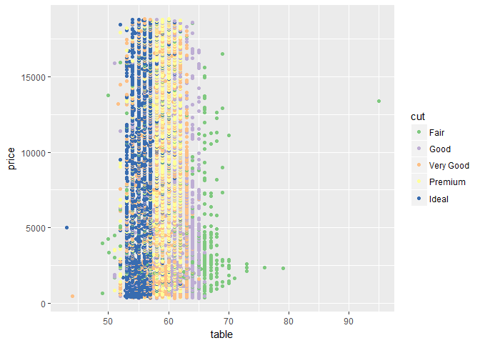

# Explore One Variable Problem Set
Justin Le  
October 26, 2017  


***


```r
library(ggplot2)
library(gridExtra)
library(dplyr)
```

```
## Warning: package 'dplyr' was built under R version 3.4.2
```

```
## 
## Attaching package: 'dplyr'
```

```
## The following object is masked from 'package:gridExtra':
## 
##     combine
```

```
## The following objects are masked from 'package:stats':
## 
##     filter, lag
```

```
## The following objects are masked from 'package:base':
## 
##     intersect, setdiff, setequal, union
```

***
Create a histogram of diamond prices. Facet the histogram by diamond color and use cut to color the histogram bars.

The plot should look something like this.
http://i.imgur.com/b5xyrOu.jpg

Note: In the link, a color palette of type 'qual' was used to color the histogram using
scale_fill_brewer(type = 'qual').


```r
data("diamonds")
str(diamonds)
```

```
## Classes 'tbl_df', 'tbl' and 'data.frame':	53940 obs. of  10 variables:
##  $ carat  : num  0.23 0.21 0.23 0.29 0.31 0.24 0.24 0.26 0.22 0.23 ...
##  $ cut    : Ord.factor w/ 5 levels "Fair"<"Good"<..: 5 4 2 4 2 3 3 3 1 3 ...
##  $ color  : Ord.factor w/ 7 levels "D"<"E"<"F"<"G"<..: 2 2 2 6 7 7 6 5 2 5 ...
##  $ clarity: Ord.factor w/ 8 levels "I1"<"SI2"<"SI1"<..: 2 3 5 4 2 6 7 3 4 5 ...
##  $ depth  : num  61.5 59.8 56.9 62.4 63.3 62.8 62.3 61.9 65.1 59.4 ...
##  $ table  : num  55 61 65 58 58 57 57 55 61 61 ...
##  $ price  : int  326 326 327 334 335 336 336 337 337 338 ...
##  $ x      : num  3.95 3.89 4.05 4.2 4.34 3.94 3.95 4.07 3.87 4 ...
##  $ y      : num  3.98 3.84 4.07 4.23 4.35 3.96 3.98 4.11 3.78 4.05 ...
##  $ z      : num  2.43 2.31 2.31 2.63 2.75 2.48 2.47 2.53 2.49 2.39 ...
```


```r
ggplot(aes(x = log(price)),
       data = diamonds) +
  geom_histogram(aes(fill = cut)) +
  facet_wrap( ~ color) +
  scale_fill_brewer(type = 'qual')
```

```
## `stat_bin()` using `bins = 30`. Pick better value with `binwidth`.
```

<!-- -->

***

Create a scatterplot of diamond price vs. table and color the points by the cut of the diamond.

The plot should look something like this.
http://i.imgur.com/rQF9jQr.jpg

Note: In the link, a color palette of type 'qual' was used to color the scatterplot using
scale_color_brewer(type = 'qual').


```r
ggplot(aes(x = table, y = price),
       data = diamonds) +
  geom_point(aes(color = cut)) +
  scale_color_brewer(type = 'qual')
```

<!-- -->

What is the typical table range for the majority of diamonds of ideal cut? 53 - 57

What is the typical table range for the majority of diamonds of premium cut? 58 - 62

***

Create a scatterplot of diamond price vs. volume (xyz) and color the points by
the clarity of diamonds. Use scale on the y-axis to take the log10 of price. You should also
omit the top 1% of diamond volumes from the plot.

Note: Volume is a very rough approximation of a diamond's actual volume.

The plot should look something like this.
http://i.imgur.com/excUpea.jpg

Note: In the link, a color palette of type 'div' was used to color the scatterplot using
scale_color_brewer(type = 'div').


```r
diamonds$volume <- diamonds$x * diamonds$y * diamonds$z

ggplot(aes(x = volume, y = price),
       data = diamonds) +
  geom_point(aes(color = clarity)) +
  scale_y_log10() +
  xlim(0, quantile(diamonds$volume, 0.99)) +
  scale_color_brewer(type = 'div')
```

```
## Warning: Removed 540 rows containing missing values (geom_point).
```

<!-- -->

***

Many interesting variables are derived from two or more others. For example, we might wonder how much of a person's network on
a service like Facebook the user actively initiated. Two users with the same degree (or number of friends) might be very
different if one initiated most of those connections on the service, while the other initiated very few. So it could be
useful to consider this proportion of existing friendships that the user initiated. This might be a good predictor of how active
a user is compared with their peers, or other traits, such as personality (i.e., is this person an extrovert?).

Your task is to create a new variable called 'prop_initiated' in the Pseudo-Facebook data set. The variable should contain
the proportion of friendships that the user initiated.


```r
pf <- read.csv('pseudo_facebook.tsv', sep = '\t')
names(pf)
```

```
##  [1] "userid"                "age"                  
##  [3] "dob_day"               "dob_year"             
##  [5] "dob_month"             "gender"               
##  [7] "tenure"                "friend_count"         
##  [9] "friendships_initiated" "likes"                
## [11] "likes_received"        "mobile_likes"         
## [13] "mobile_likes_received" "www_likes"            
## [15] "www_likes_received"
```

***


```r
pf$prop_initiated <- pf$friendships_initiated / pf$friend_count

summary(pf$prop_initiated)
```

```
##    Min. 1st Qu.  Median    Mean 3rd Qu.    Max.    NA's 
##  0.0000  0.4524  0.6250  0.6078  0.7838  1.0000    1962
```

***

Create a line graph of the median proportion of friendships initiated ('prop_initiated') vs.
tenure and color the line segment by year_joined.bucket.

Recall, we created year_joined.bucket in Lesson 5 by first creating year_joined from the variable tenure.
Then, we used the cut function on year_joined to create four bins or cohorts of users.

(2004, 2009]
(2009, 2011]
(2011, 2012]
(2012, 2014]

The plot should look something like this.
http://i.imgur.com/vNjPtDh.jpg
OR this
http://i.imgur.com/IBN1ufQ.jpg

Notes: First, need to use tenure to create a year_joined variable. Then bucket those years into those four bins.
Create a variable called year_joined in the pf data frame using the variable tenure and 2014 as the reference year.


```r
pf$year_joined <- floor(2014 - (pf$tenure/365))

summary(pf$year_joined)
```

```
##    Min. 1st Qu.  Median    Mean 3rd Qu.    Max.    NA's 
##    2005    2012    2012    2012    2013    2014       2
```

```r
table(pf$year_joined)
```

```
## 
##  2005  2006  2007  2008  2009  2010  2011  2012  2013  2014 
##     9    15   581  1507  4557  5448  9860 33366 43588    70
```


```r
pf$year_joined.bucket <- cut(pf$year_joined,
                             c(2004, 2009, 2011, 2012, 2014))

table(pf$year_joined.bucket, useNA = 'ifany')
```

```
## 
## (2004,2009] (2009,2011] (2011,2012] (2012,2014]        <NA> 
##        6669       15308       33366       43658           2
```


```r
ggplot(aes(x = tenure, y = prop_initiated),
       data = subset(pf, !is.na(year_joined.bucket))) +
  geom_line(aes(color = year_joined.bucket),
            stat = 'summary', fun.y = median)
```

```
## Warning: Removed 1962 rows containing non-finite values (stat_summary).
```

<!-- -->


```r
with(pf, cor.test(prop_initiated, tenure, method = 'pearson'))
```

```
## 
## 	Pearson's product-moment correlation
## 
## data:  prop_initiated and tenure
## t = -90.631, df = 97037, p-value < 2.2e-16
## alternative hypothesis: true correlation is not equal to 0
## 95 percent confidence interval:
##  -0.2851501 -0.2735484
## sample estimates:
##        cor 
## -0.2793594
```

Notes: Just wanted to check with the correlation coefficient was between prop_initiated and tenure, if there
is a linear relationship, etc.

***

Smooth the last plot you created of of prop_initiated vs tenure colored by year_joined.bucket. You can bin together ranges
of tenure or add a smoother to the plot.


```r
ggplot(aes(x = tenure, y = prop_initiated),
       data = subset(pf, !is.na(year_joined.bucket))) +
  geom_line(aes(color = year_joined.bucket),
            stat = 'summary', fun.y = median) +
  geom_smooth()
```

```
## Warning: Removed 1962 rows containing non-finite values (stat_summary).
```

```
## `geom_smooth()` using method = 'gam'
```

```
## Warning: Removed 1962 rows containing non-finite values (stat_smooth).
```

<!-- -->


```r
ggplot(aes(x = tenure, y = prop_initiated),
       data = subset(pf, !is.na(year_joined.bucket))) +
  geom_smooth(aes(color = year_joined.bucket))
```

```
## `geom_smooth()` using method = 'gam'
```

```
## Warning: Removed 1962 rows containing non-finite values (stat_smooth).
```

<!-- -->

On average, which group initiated the greatest proportion of its Facebook friendships? -> People who joined after 2012

For the group with the largest proportion of friendships initiated, what is the group's
average (mean) proportion of friendships initiated? -> 0.6654


```r
by(pf$prop_initiated, pf$year_joined.bucket, summary)
```

```
## pf$year_joined.bucket: (2004,2009]
##    Min. 1st Qu.  Median    Mean 3rd Qu.    Max.    NA's 
##  0.0000  0.3418  0.4672  0.4668  0.5910  1.0000       5 
## -------------------------------------------------------- 
## pf$year_joined.bucket: (2009,2011]
##    Min. 1st Qu.  Median    Mean 3rd Qu.    Max.    NA's 
##  0.0000  0.3924  0.5357  0.5301  0.6750  1.0000      81 
## -------------------------------------------------------- 
## pf$year_joined.bucket: (2011,2012]
##    Min. 1st Qu.  Median    Mean 3rd Qu.    Max.    NA's 
##  0.0000  0.4576  0.6189  0.5985  0.7619  1.0000     408 
## -------------------------------------------------------- 
## pf$year_joined.bucket: (2012,2014]
##    Min. 1st Qu.  Median    Mean 3rd Qu.    Max.    NA's 
##  0.0000  0.5115  0.7018  0.6654  0.8490  1.0000    1468
```

Why do you think this group's proportion of friendships initiated is higher than the others?
Maybe it's because of the increasing use of phones, etc. from younger users.

***

Create a scatter plot of the price/carat ratio of diamonds. The variable x should be
assigned to cut. The points should be colored by diamond color, and the plot should be
faceted by clarity.

The plot should look something like this.
http://i.imgur.com/YzbWkHT.jpg.

Note: In the link, a color palette of type 'div' was used to color the histogram using
scale_color_brewer(type = 'div').


```r
ggplot(aes(x = cut, y = price/carat),
       data = diamonds) +
  geom_jitter(aes(color = color)) +
  facet_wrap( ~ clarity) +
  scale_color_brewer(type = 'div')
```

<!-- -->

The Gapminder website contains over 500 data sets with information about
the world's population. Your task is to continue the investigation you did at the
# end of Problem Set 4 or you can start fresh and choose a different
# data set from Gapminder.

If you’re feeling adventurous or want to try some data munging see if you can
find a data set or scrape one from the web.

In your investigation, examine 3 or more variables and create 2-5 plots that make
use of the techniques from Lesson 5.

You can find a link to the Gapminder website in the Instructor Notes.

Once you've completed your investigation, create a post in the discussions that includes:
      1. the variable(s) you investigated, your observations, and any summary statistics
      2. snippets of code that created the plots
      3. links to the images of your plots

***
