# Explore One Variable
Justin Le  
October 26, 2017  


### Pseudo-Facebook User Data
Notes:


```r
getwd()
```

```
## [1] "D:/GitHub_Repos/Learning-R"
```

```r
setwd('D:/Udacity Data Analysis with R/Lesson 3')
list.files()
```

```
## [1] "lesson3_student.html" "lesson3_student.rmd"  "pseudo_facebook.tsv"
```

```r
pf <- read.csv('pseudo_facebook.tsv', sep = '\t')
names(pf)
```

```
##  [1] "userid"                "age"                  
##  [3] "dob_day"               "dob_year"             
##  [5] "dob_month"             "gender"               
##  [7] "tenure"                "friend_count"         
##  [9] "friendships_initiated" "likes"                
## [11] "likes_received"        "mobile_likes"         
## [13] "mobile_likes_received" "www_likes"            
## [15] "www_likes_received"
```

***

### Histogram of Users' Birthdays
Notes:


```r
library(ggplot2)

names(pf)
```

```
##  [1] "userid"                "age"                  
##  [3] "dob_day"               "dob_year"             
##  [5] "dob_month"             "gender"               
##  [7] "tenure"                "friend_count"         
##  [9] "friendships_initiated" "likes"                
## [11] "likes_received"        "mobile_likes"         
## [13] "mobile_likes_received" "www_likes"            
## [15] "www_likes_received"
```

```r
#qplot(x = dob_day, data = pf) +
#  scale_x_discrete(breaks=1:31)
#Error: StatBin requires a continuous x variable the x variable is discrete. Perhaps you want stat="count"?

ggplot(aes(x = dob_day), data = pf) +
  geom_histogram(binwidth = 1) +
  scale_x_continuous(breaks = 1:31)
```

<!-- -->

***

#### What are some things that you notice about this histogram?
Response:

***

### Moira's Investigation
Notes:

***

### Estimating Your Audience Size
Notes:

***

#### Think about a time when you posted a specific message or shared a photo on Facebook. What was it?
Response:

#### How many of your friends do you think saw that post?
Response:

#### Think about what percent of your friends on Facebook see any posts or comments that you make in a month. What percent do you think that is?
Response:

***

### Perceived Audience Size
Notes:

***
### Faceting
Notes:


```r
ggplot(aes(x = dob_day), data = pf) +
  geom_histogram(binwidth = 1) +
  scale_x_continuous(breaks = 1:31) +
  facet_wrap(~dob_month, ncol = 3)
```

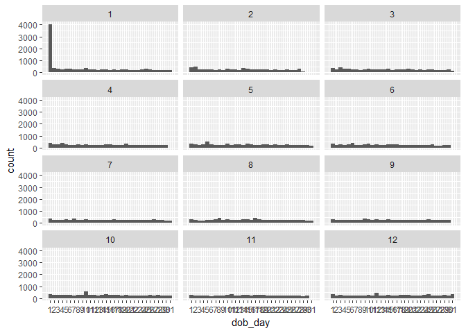<!-- -->

#### Let’s take another look at our plot. What stands out to you here?
Response:

***

### Be Skeptical - Outliers and Anomalies
Notes:

***

### Moira's Outlier
Notes:
#### Which case do you think applies to Moira’s outlier?
Response:

***

### Friend Count
Notes:

#### What code would you enter to create a histogram of friend counts?


```r
#qplot(x = friend_count, data = pf)

ggplot(aes(x = friend_count), data = pf) +
  geom_histogram()
```

```
## `stat_bin()` using `bins = 30`. Pick better value with `binwidth`.
```

<!-- -->

#### How is this plot similar to Moira's first plot?
Response:

***

### Limiting the Axes
Notes:


```r
#qplot(x = friend_count, data = pf, binwidth = 25) +
#  scale_x_continuous(limits = c(0, 1000), breaks = seq(0, 1000, 50))

ggplot(aes(x = friend_count), data = pf) +
  geom_histogram(binwidth = 25) +
  scale_x_continuous(limits = c(0, 1000), breaks = seq(0, 1000, 50))
```

```
## Warning: Removed 2951 rows containing non-finite values (stat_bin).
```

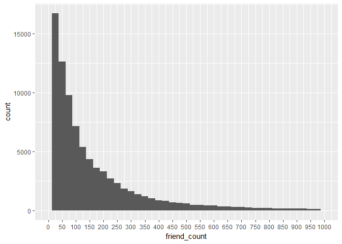<!-- -->

### Exploring with Bin Width
Notes:

***

### Adjusting the Bin Width
Notes:

### Faceting Friend Count

```r
# What code would you add to create a facet the histogram by gender?
# Add it to the code below.
qplot(x = friend_count, data = pf, binwidth = 10) +
  scale_x_continuous(limits = c(0, 1000),
                     breaks = seq(0, 1000, 50)) +
  facet_wrap(~gender)
```

```
## Warning: Removed 2951 rows containing non-finite values (stat_bin).
```

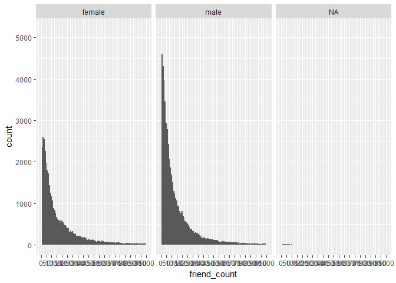<!-- -->

***

### Omitting NA Values
Notes:


```r
qplot(x = friend_count, data = subset(pf, !is.na(gender)), binwidth = 10) +
  scale_x_continuous(limits = c(0, 1000),
                     breaks = seq(0, 1000, 50)) +
  facet_wrap(~gender)
```

```
## Warning: Removed 2949 rows containing non-finite values (stat_bin).
```

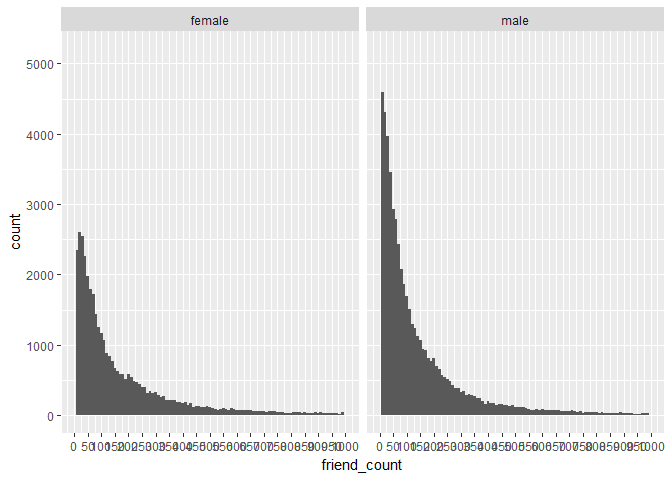<!-- -->

***

### Statistics 'by' Gender
Notes:


```r
table(pf$gender)
```

```
## 
## female   male 
##  40254  58574
```

```r
by(pf$friend_count, pf$gender, summary)
```

```
## pf$gender: female
##    Min. 1st Qu.  Median    Mean 3rd Qu.    Max. 
##       0      37      96     242     244    4923 
## -------------------------------------------------------- 
## pf$gender: male
##    Min. 1st Qu.  Median    Mean 3rd Qu.    Max. 
##       0      27      74     165     182    4917
```


#### Who on average has more friends: men or women?
Response:

#### What's the difference between the median friend count for women and men?
Response:

#### Why would the median be a better measure than the mean?
Response: Because outliers would pull the mean far to the right, skewing the data. Median is a more robust datapoint.

***

### Tenure
Notes:


```r
qplot(x = tenure, data = pf, binwidth = 30, color = I('black'), fill = I('#099DD9'))
```

```
## Warning: Removed 2 rows containing non-finite values (stat_bin).
```

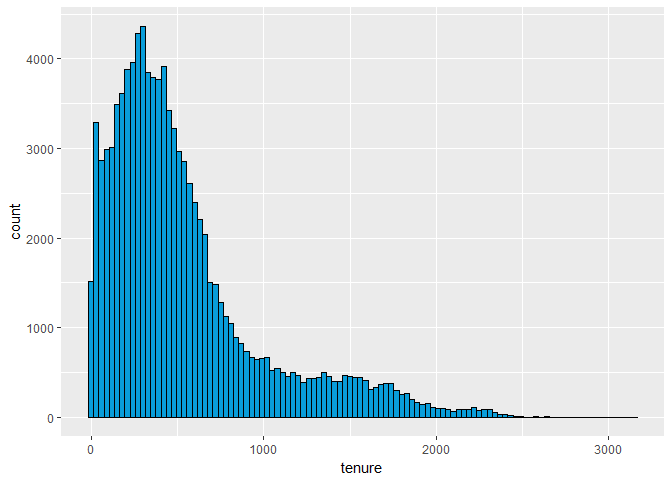<!-- -->

***

#### How would you create a histogram of tenure by year?


```r
qplot(x = tenure/365, data = pf, binwidth = .25, color = I('black'), fill = I('#F79420')) +
  scale_x_continuous(breaks = seq(1, 7, 1), lim = c(0, 7))
```

```
## Warning: Removed 26 rows containing non-finite values (stat_bin).
```

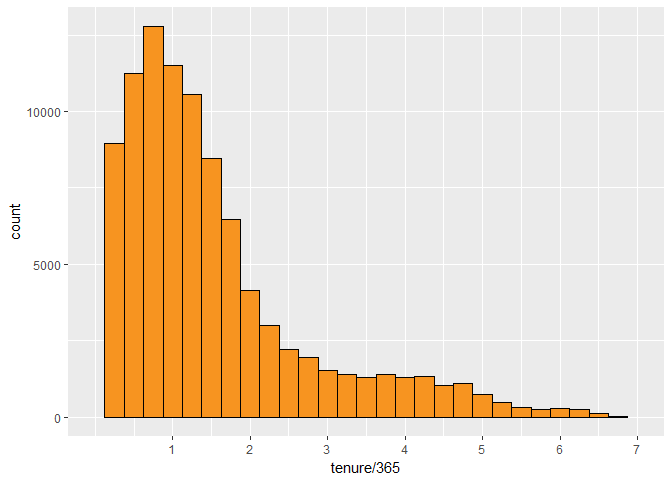<!-- -->

***

### Labeling Plots
Notes:


```r
qplot(x = tenure/365, data = pf, binwidth = .25,
      xlab = 'Number of Years Using Facebook',
      ylab = 'Number of Users in Sample',
      color = I('black'), fill = I('#F79420')) +
  scale_x_continuous(breaks = seq(1, 7, 1), lim = c(0, 7))
```

```
## Warning: Removed 26 rows containing non-finite values (stat_bin).
```

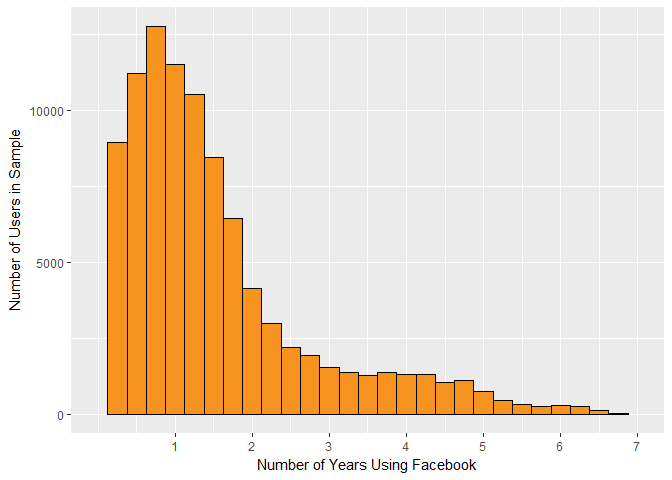<!-- -->

***

### User Ages
Notes:


```r
ggplot(aes(x = age), data = pf) +
  geom_histogram(binwidth = 1, fill = '#5760AB') +
  scale_x_continuous(breaks = seq(0, 113, 5))
```

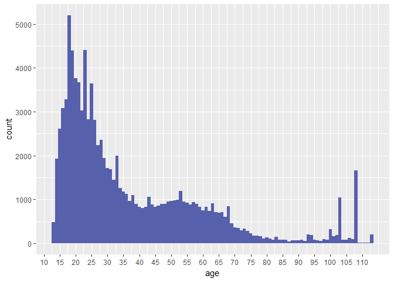<!-- -->

#### What do you notice?
Response:

***

### The Spread of Memes
Notes:

***

### Lada's Money Bag Meme
Notes:

***

### Transforming Data
Notes:
***

### Create multiple plots on one page
Notes: install.packages("gridExtra")
  # define individual plots
    p1 = ggplot(...)
    p2 = ggplot(...)
    p3 = ggplot(...)
    p4 = ggplot(...)
  # arrange plots in grid
    grid.arrange(p1, p2, p3, p4, ncol=2)
    

```r
qplot(x = friend_count, data = pf)
```

```
## `stat_bin()` using `bins = 30`. Pick better value with `binwidth`.
```

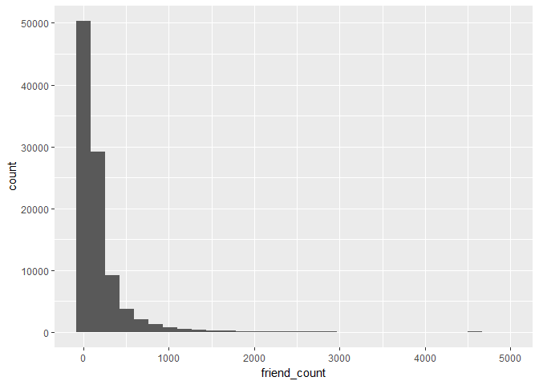<!-- -->

```r
summary(pf$friend_count)
```

```
##    Min. 1st Qu.  Median    Mean 3rd Qu.    Max. 
##     0.0    31.0    82.0   196.4   206.0  4923.0
```

```r
summary(log10(pf$friend_count + 1))
```

```
##    Min. 1st Qu.  Median    Mean 3rd Qu.    Max. 
##   0.000   1.505   1.919   1.868   2.316   3.692
```

```r
summary(sqrt(pf$friend_count))
```

```
##    Min. 1st Qu.  Median    Mean 3rd Qu.    Max. 
##   0.000   5.568   9.055  11.088  14.353  70.164
```


### Transforming Data Solution


```r
library(gridExtra)

p1 <- qplot(x = friend_count, data = pf)
p2 <- qplot(x = log10(friend_count + 1), data = pf)
p3 <- qplot(x = sqrt(friend_count), data = pf)

grid.arrange(p1, p2, p3, ncol = 1)
```

```
## `stat_bin()` using `bins = 30`. Pick better value with `binwidth`.
## `stat_bin()` using `bins = 30`. Pick better value with `binwidth`.
## `stat_bin()` using `bins = 30`. Pick better value with `binwidth`.
```

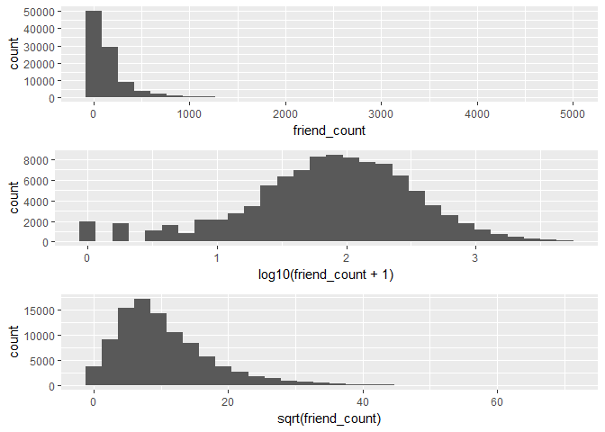<!-- -->

***

### Add a Scaling Layer
Notes:


```r
p1 <- ggplot(aes(x = friend_count), data = pf) + geom_histogram()
p2 <- p1 + scale_x_log10()
p3 <- p1 + scale_x_sqrt()

grid.arrange(p1, p2, p3, ncol = 1)
```

```
## `stat_bin()` using `bins = 30`. Pick better value with `binwidth`.
```

```
## Warning: Transformation introduced infinite values in continuous x-axis
```

```
## `stat_bin()` using `bins = 30`. Pick better value with `binwidth`.
```

```
## Warning: Removed 1962 rows containing non-finite values (stat_bin).
```

```
## `stat_bin()` using `bins = 30`. Pick better value with `binwidth`.
```

<!-- -->

***

### Frequency Polygons


```r
qplot(x = friend_count, y = ..count../sum(..count..),
      data = subset(pf, !is.na(gender)),
      xlab = 'Friend Count',
      ylab = 'Proportion of Users with that Friend Count',
      binwidth = 10, geom = 'freqpoly', color = gender) +
  scale_x_continuous(limits = c(0, 1000), breaks = seq(0, 1000, 50))
```

```
## Warning: Removed 2949 rows containing non-finite values (stat_bin).
```

```
## Warning: Removed 4 rows containing missing values (geom_path).
```

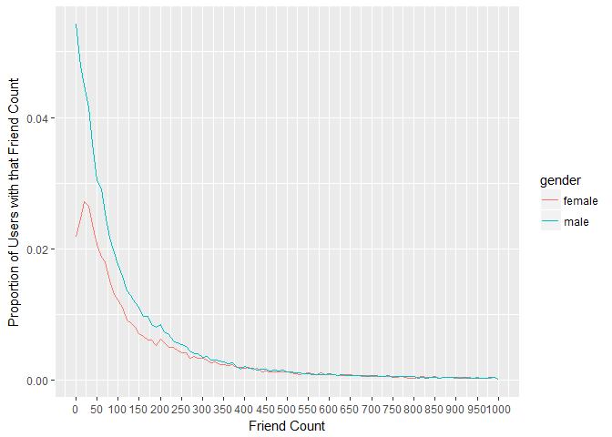<!-- -->

```r
ggplot(aes(x = friend_count, y = ..count../sum(..count..)),
       data = subset(pf, !is.na(gender))) +
  geom_freqpoly(aes(color = gender), binwidth = 10) +
  scale_x_continuous(limits = c(0, 1000), breaks = seq(0, 1000, 50)) +
  xlab('Friend Count') +
  ylab('Proportion of users with that friend count')
```

```
## Warning: Removed 2949 rows containing non-finite values (stat_bin).

## Warning: Removed 4 rows containing missing values (geom_path).
```

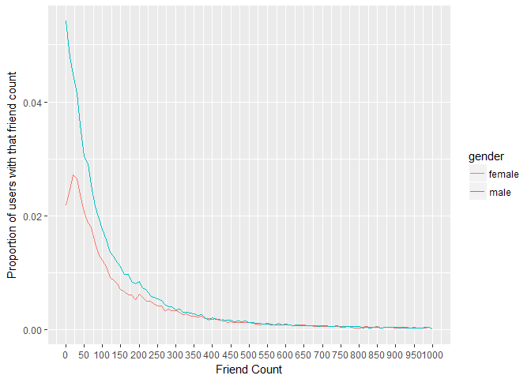<!-- -->


***

### Likes on the Web
Notes:

What's the www_like count for males? --> 1430175

Which gender has more www_likes? --> Females


```r
by(pf$www_likes, pf$gender, sum)
```

```
## pf$gender: female
## [1] 3507665
## -------------------------------------------------------- 
## pf$gender: male
## [1] 1430175
```


```r
ggplot(aes(x = www_likes), data = subset(pf, !is.na(gender))) +
  geom_freqpoly(aes(color = gender)) +
  scale_x_log10()
```

```
## Warning: Transformation introduced infinite values in continuous x-axis
```

```
## `stat_bin()` using `bins = 30`. Pick better value with `binwidth`.
```

```
## Warning: Removed 60935 rows containing non-finite values (stat_bin).
```

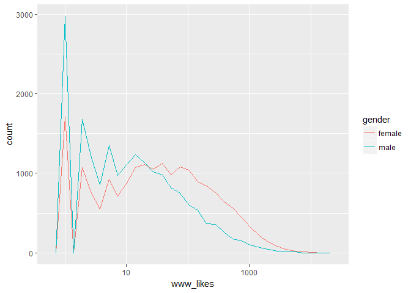<!-- -->

***

### Box Plots
Notes:


```r
qplot(x = gender, y = friend_count,
      data = subset(pf, !is.na(gender)),
      geom = 'boxplot')
```

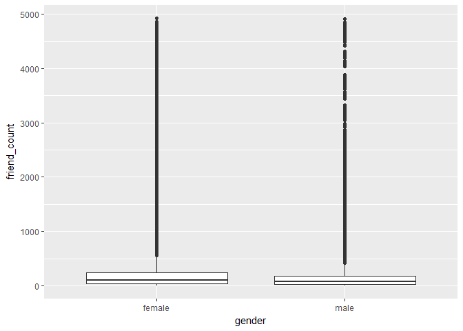<!-- -->

#### Adjust the code to focus on users who have friend counts between 0 and 1000.
Notes:scale_x/y_continuous clips (removes unseen data points) outside of given range
coord_cartesian (preferred) does not remove data points from calculations


```r
ggplot(aes(x = gender, y = friend_count),
       data = subset(pf, !is.na(gender))) +
  geom_boxplot() +
  scale_y_continuous(limits = c(0, 1000))
```

```
## Warning: Removed 2949 rows containing non-finite values (stat_boxplot).
```

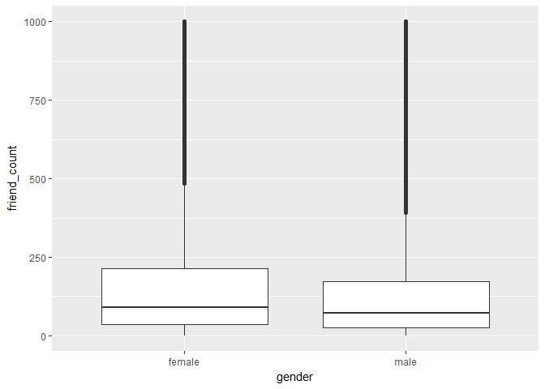<!-- -->

```r
ggplot(aes(x = gender, y = friend_count),
       data = subset(pf, !is.na(gender))) +
  geom_boxplot() +
  coord_cartesian(ylim = c(0, 1000))
```

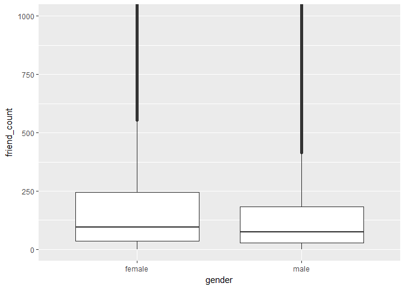<!-- -->

***

### Box Plots, Quartiles, and Friendships
Notes:


```r
qplot(x = gender, y = friend_count,
      data = subset(pf, !is.na(gender)),
      geom = 'boxplot') +
  coord_cartesian(ylim = c(0, 250))
```

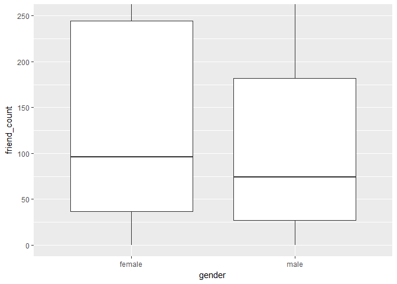<!-- -->

```r
by(pf$friend_count, pf$gender, summary)
```

```
## pf$gender: female
##    Min. 1st Qu.  Median    Mean 3rd Qu.    Max. 
##       0      37      96     242     244    4923 
## -------------------------------------------------------- 
## pf$gender: male
##    Min. 1st Qu.  Median    Mean 3rd Qu.    Max. 
##       0      27      74     165     182    4917
```

#### On average, who initiated more friendships in our sample: men or women?
Response: women 
#### Write about some ways that you can verify your answer.
Response:

```r
ggplot(aes(x = gender, y = friendships_initiated),
       data = subset(pf, !is.na(gender))) +
  geom_boxplot() +
  coord_cartesian(ylim = c(0, 150))
```

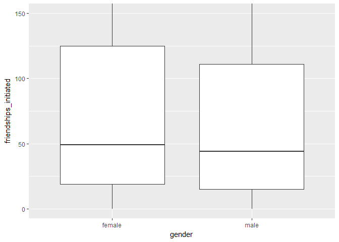<!-- -->

```r
by(pf$friendships_initiated, pf$gender, summary)
```

```
## pf$gender: female
##    Min. 1st Qu.  Median    Mean 3rd Qu.    Max. 
##     0.0    19.0    49.0   113.9   124.8  3654.0 
## -------------------------------------------------------- 
## pf$gender: male
##    Min. 1st Qu.  Median    Mean 3rd Qu.    Max. 
##     0.0    15.0    44.0   103.1   111.0  4144.0
```

***

### Getting Logical
Notes: Sometimes when there's a variable with a lot of zeros you may want to transform the data into something more usable.
Here we take mobile logins. Using the raw data isn't that useful. So we can ask the question of how many have ever used mobile login. We can
transform the data into binary.


```r
summary(pf$mobile_likes)
```

```
##    Min. 1st Qu.  Median    Mean 3rd Qu.    Max. 
##     0.0     0.0     4.0   106.1    46.0 25111.0
```

```r
summary(pf$mobile_likes > 0)
```

```
##    Mode   FALSE    TRUE 
## logical   35056   63947
```

```r
pf$mobile_check_in <- NA
pf$mobile_check_in <- ifelse(pf$mobile_likes > 0, 1, 0)
pf$mobile_check_in <- factor(pf$mobile_check_in)
summary(pf$mobile_check_in)
```

```
##     0     1 
## 35056 63947
```

```r
sum(pf$mobile_check_in == 1)/length(pf$mobile_check_in)
```

```
## [1] 0.6459097
```
Response:

***

### Analyzing One Variable
Reflection:
